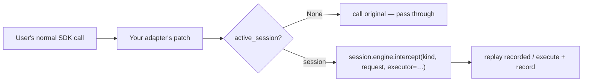

# Custom Adapters

**An adapter patches a library's client so its calls route through the AgentTape engine automatically — no `@tool` wrapping, no code changes for users. This is how the OpenAI adapter works, and how you'd add one for Anthropic, Gemini, or any SDK.**

---

## When you need one

You have three ways to capture a call: a dedicated **adapter**, the always-on **httpx/requests fallback**, or a **`@agenttape.tool`** wrapper. Reach for a custom adapter when:

- The SDK isn't built on `httpx`/`requests` (so the fallback can't see it), **or**
- You want rich semantics (token usage, model params) and to hand users back real SDK objects, **or**
- You want users to need *zero* code changes — just `use_cassette` and their normal SDK calls.



---

## The `Adapter` interface

An adapter is a class with three methods. Subclass `Adapter` and register an instance.

```python
from agenttape.adapters.base import Adapter, RefCountedPatch
from agenttape.recorder import active_session

class MyAdapter(Adapter):
    name = "my_sdk"

    def __init__(self) -> None:
        self._patch = RefCountedPatch()

    def available(self) -> bool:
        """True if the target library is importable."""
        try:
            import my_sdk  # noqa: F401
        except Exception:
            return False
        return True

    def install(self, session) -> None:
        """Patch the target. RefCountedPatch installs once across nested sessions."""
        self._patch.acquire(self._do_install)

    def uninstall(self) -> None:
        self._patch.release()

    def _do_install(self) -> list:
        import my_sdk
        original = my_sdk.Client.make_request

        def interceptor(self_obj, *args, **kwargs):
            session = active_session()
            if session is None:                 # outside a session: pass through
                return original(self_obj, *args, **kwargs)
            request = _serialize_request(kwargs)  # MUST be JSON-like primitives
            def executor():
                return _serialize_response(original(self_obj, *args, **kwargs))
            recorded = session.engine.intercept(
                "http", request, boundary="my_sdk", executor=executor,
            )
            return _rehydrate(recorded)           # turn the dict back into an SDK object
        my_sdk.Client.make_request = interceptor
        return [lambda: setattr(my_sdk.Client, "make_request", original)]
```

Register it so every session installs it when the library is present:

```python
import agenttape.adapters as adapters
adapters.register(MyAdapter())
```

| Method | Responsibility |
| --- | --- |
| `available()` | Is the target library importable? (Adapters install only when available.) |
| `install(session)` | Patch the target to route through `session.engine`. |
| `uninstall()` | Restore the original. |

!!! tip "Use `RefCountedPatch`"
    Nested sessions should share **one** patch that routes to whichever session is active at call time. `RefCountedPatch` installs on first acquire and restores on last release — it's lock-guarded so concurrent sessions across threads can't corrupt the count. Always check `active_session()` inside the patched callable and pass through when it's `None`.

---

## The hard part: serialization

Everything you hand the engine — `request` and the executor's return value — **must be JSON-like primitives** (dicts, lists, strings, numbers, bools, `None`). The engine's `intercept` records the request for matching and the response for replay.

So your adapter has two translation jobs:

1. **Serialize** the SDK's request and response objects into plain dicts before they reach the engine.
2. **Rehydrate** the recorded dict back into the SDK's response type on replay, so the user's code (`resp.choices[0].message.content`) works unchanged.

The OpenAI adapter is the reference implementation: it dumps responses with `model_dump(mode="json")` and rehydrates with `ChatCompletion.model_validate(...)`, falling back to an attribute-accessible `Box` when the SDK isn't importable (so replay works offline even without `openai`).

```python title="agenttape/adapters/openai.py (excerpt)"
def _dump(resp):
    return resp.model_dump(mode="json")   # → plain JSON-native dict

def _rehydrate_chat(data):
    from openai.types.chat import ChatCompletion
    return ChatCompletion.model_validate(data)   # dict → real SDK object
```

---

## Patterns worth copying

!!! note "From the built-in adapters"
    - **Drop volatile/transport kwargs** from the recorded request (`stream`, `timeout`, `extra_headers`) so matching stays stable — see the OpenAI adapter's `_DROP_KEYS`.
    - **Refuse to fake streaming.** A token stream can't be recorded deterministically; raise (or warn) rather than silently calling the network in a replay mode.
    - **Record token usage** via the engine's `usage_extractor` hook so `agenttape inspect` can report tokens and cost.
    - **Patch sync *and* async** entry points if the SDK has both.

---

## Where adapters live

Adapters aren't yet exposed through a stable public plugin API — built-ins live in `src/agenttape/adapters/` and are registered in `adapters/__init__.py`. To add one, drop a module there, subclass `Adapter`, and `register()` it. The registry installs every *available* adapter per session.

!!! tip "Contribute it upstream"
    Wrote an adapter for Anthropic, Gemini, LangChain, or LlamaIndex? Open a pull request. Official adapters are maintained against SDK changes so the whole community benefits.

---

## FAQ

??? question "Adapter vs `@agenttape.tool` — which should I write?"
    Use `@tool` for app-level functions you own. Write an adapter when you want to intercept a *library* transparently for all its users, or to capture SDK-specific semantics. If the SDK uses httpx/requests, the [fallback](recording-apis.md) may already cover you with no work.

??? question "How do I avoid double-recording when my SDK uses httpx underneath?"
    The engine's re-entrancy guard handles it: while your adapter's executor runs, the nested httpx call passes through instead of being recorded again. The outermost boundary wins.

---

## Summary

- An adapter subclasses `Adapter` (`available`/`install`/`uninstall`) and is `register()`ed.
- Inside the patch, check `active_session()` and route through `session.engine.intercept(...)`.
- The real work is serialization: SDK object → JSON dict for the engine, and back on replay.
- Use `RefCountedPatch`, drop volatile kwargs, and patch sync + async.

[Next: Internals →](internals.md){ .md-button .md-button--primary }
