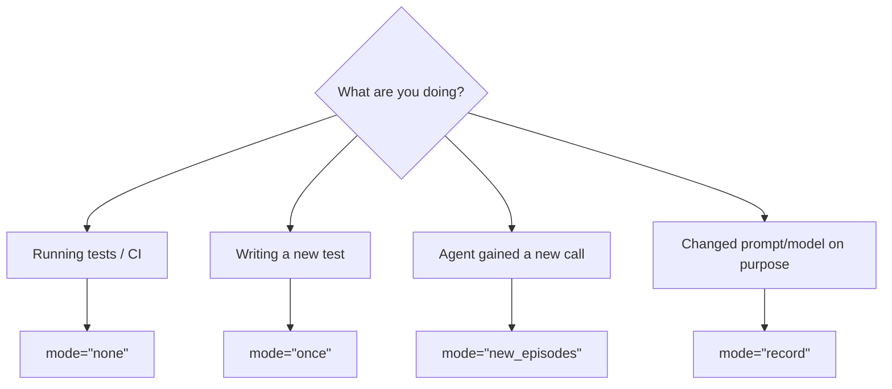

# Cassette Modes

**The mode is a single setting that decides — per request — whether AgentTape replays a recording or calls the real service.**

```python
with agenttape.use_cassette("my_test", mode="none"):
    ...
```

---

## The five modes

| Mode | If a recording exists | If the request is new | Network | Use it for |
| --- | --- | --- | --- | --- |
| **`none`** *(default)* | Replay it | **Raise** error | Off | CI, local tests |
| **`once`** | Replay all | Record all *(only if file is absent)* | First run only | Writing a test the lazy way |
| **`new_episodes`** | Replay it | Record & append it | New requests only | Incrementally growing a cassette |
| **`all`** | Ignore it | Record fresh | Always | Re-recording from scratch |
| **`record`** | *(alias of `all`)* | Record fresh | Always | Same as `all`, clearer intent |

!!! info "Defaults"
    `none` is the default everywhere — `use_cassette` with no mode, the `@replay` decorator, and the pytest plugin all default to offline replay. That's intentional: the safe, free, deterministic path should be the one you get for free.

---

## How each mode behaves

=== "none"

    **Strict replay. Never touches the network.**

    - Matched request → returns the recording.
    - New request → raises [`UnmatchedInteractionError`](debugging.md).
    - Missing cassette → starts with an empty recording, so the first request raises [`UnmatchedInteractionError`](debugging.md).

    This is the only mode that **guarantees** no network and no side effects. Use it in CI.

=== "once"

    **Record the first time, replay after that.**

    - Cassette file absent → record everything and write the file.
    - Cassette file present → behave exactly like `none` (strict replay).

    Great for "write the test, run it once to capture, then it's frozen."

=== "new_episodes"

    **Replay what you know, record what you don't.**

    - Matched request → replay it.
    - New request (e.g. your agent made a follow-up call it didn't before) → hit the network, append it to the cassette, return the real result.

    Use it when an agent's path is growing and you want to top up the cassette without re-recording everything.

=== "all / record"

    **Always record. Ignore any existing cassette.**

    - Every request hits the network and the cassette is rewritten from scratch.
    - `record` is a readable alias for `all`.

    Use it to refresh a cassette after an intentional change.

---

## Choosing a mode



---

## Setting the mode

=== "Per call"

    ```python
    with agenttape.use_cassette("checkout", mode="record"):
        run_agent()
    ```

=== "Project default"

    ```toml title="agenttape.toml"
    default_mode = "none"
    ```

=== "In pytest"

    ```bash
    pytest                       # mode=none (default)
    pytest --agenttape-record    # forces mode=all for marked tests
    pytest --agenttape-mode once # override the mode for this run
    ```

---

## Best practices

!!! tip "Recommended workflow"
    - **CI: always `none`.** It's the only way to guarantee no network and no side effects.
    - **Writing tests: `once` or `new_episodes`.** Build the suite without juggling modes by hand.
    - **Updating a prompt or model: `record` once, then back to `none`.** The old recording is invalid the moment you change the input.
    - **Commit cassettes to Git.** They're the source of truth for how your agent behaved.

---

## FAQ

??? question "What's the difference between `none` and `once` on an existing cassette?"
    Nothing — when the cassette already exists, `once` behaves identically to `none` (strict replay). The difference is only on the **first** run, when `once` records and `none` raises.

??? question "Will `new_episodes` ever overwrite an existing recording?"
    No. It only *appends* new interactions. To replace existing recordings, use `all`/`record`.

??? question "Does `record` mode also freeze the clock?"
    By default, the freeze layer is on in `mode="none"` and off in recording modes — but AgentTape still pins the clock during recording so the agent observes the same time it will see on replay. See [Determinism](determinism.md).

---

## Summary

- `none` — strict replay, no network. **The default; use it in CI.**
- `once` — record if the file is missing, otherwise replay.
- `new_episodes` — replay matches, record & append new requests.
- `all` / `record` — ignore the old file, record everything fresh.

[Next: Configuration →](configuration.md){ .md-button .md-button--primary }
