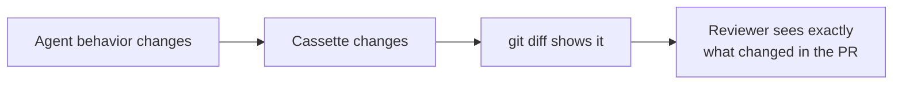

# Cassettes

**A cassette is a plain-YAML recording of every boundary your agent crossed during a session. It's the single source of truth that replay reads from.**

---

## What's in a cassette

A cassette has run metadata plus an ordered list of **interactions** — one per boundary crossing (an LLM call, a tool call, an HTTP request).

```yaml title="cassettes/weather.yaml"
version: '1'
created_at: '2026-06-17T12:00:00.000000'
run_id: bee71bc9-33b8-431b-8012-00a753783931
meta:
  agenttape_version: 0.1.5
  mode: record
  freeze:
    features: [clock, random, uuid]
    base_time: 1781706140.86
    base_iso: '2026-06-17T12:00:00+00:00'
interactions:
  - index: 0
    kind: llm
    boundary: llm
    request:
      endpoint: chat.completions
      model: gpt-5.5
      messages:
        - role: user
          content: What is the weather in London?
    response:
      choices:
        - message:
            content: I'll check the weather tool.
            tool_calls:
              - function: {name: get_weather, arguments: '{"city":"London"}'}
    usage: {total_tokens: 42}
    latency_ms: 640.2
    match_key: 'sha256:9c1f...'

  - index: 1
    kind: tool
    boundary: get_weather
    request:
      name: get_weather
      args: {city: London}
    response: {temp: 15, condition: rainy}
    latency_ms: 88.0
    match_key: 'sha256:1ed9...'
```

---

## The two layers

### `meta` — about the session

| Field | Meaning |
| --- | --- |
| `agenttape_version` | The version that recorded it |
| `mode` | The mode used to record |
| `freeze` | The pinned clock/UUID/random state, so replay reproduces it byte-for-byte |
| `tags` | Optional labels you attached |

Top-level `version`, `created_at`, and `run_id` sit beside `meta` and identify the schema version and this specific run.

### `interactions` — what happened

An ordered list. Each interaction records one boundary crossing:

| Field | Meaning |
| --- | --- |
| `index` | Position in the run (0-based) |
| `kind` | `llm`, `tool`, `retrieval`, `memory_read`, `memory_write`, or `http` |
| `boundary` | The specific name — a tool function name, or `"llm"` |
| `request` | The inputs (used to match on replay) |
| `response` *or* `error` | The output, or a serialized exception |
| `match_key` | A `sha256:` hash of the canonical request |
| `usage`, `latency_ms`, `tags` | Captured metrics and labels |

[Complete field reference →](format.md){ .md-button }

---

## Why YAML?

Because a recording you can't read is a recording you can't trust.



A binary format would hide drift. Plain YAML makes every behavioral change a reviewable line in a pull request — and lets you hand-edit responses to test edge cases.

---

## Hand-editing cassettes

Editing the YAML is a first-class debugging technique. To test how your code handles a malformed LLM response:

1. Record a successful interaction.
2. Open the cassette.
3. Change `response` to the broken shape you want to test — e.g. `content: '{"invalid": json'`.
4. Run your test in `mode="none"`.

Your code receives the broken payload and you exercise your error handling — no network, no prompt engineering.

!!! warning "Edit responses freely; edit requests carefully"
    Changing a **response** (or `usage`, `latency_ms`) is safe. Changing a **request** field changes the `match_key`, so the recording won't match your code's call anymore — unless you change the code to match. Don't reorder `interactions` unless your code's call order changed too. See the [editing guidelines](format.md#editing-guidelines).

---

## Where cassettes live

By default in `cassettes/` next to your code; configurable via `cassette_dir`. Large binary payloads (images, big blobs) are written to a sibling assets directory instead of being inlined, keeping the YAML readable. Commit cassettes to Git alongside your tests.

---

## FAQ

??? question "Can I read a cassette without installing AgentTape?"
    Yes — it's standard YAML. Any YAML parser in any language can read it. That's the basis for [building tools on top of AgentTape](extending.md).

??? question "What's a `.derived.yaml` file?"
    When you run with `live={...}` ([Partial Replay](mixed-replay.md)), AgentTape writes the new run to `name.derived.yaml` instead of overwriting your original. Diff them to see what changed.

??? question "What does `match_key` do?"
    It's how the [replay engine](replay-engine.md) finds the right recording for an incoming request — a hash of the request after volatile fields are dropped. You normally never touch it.

---

## Summary

- A cassette = run `meta` + an ordered list of `interactions`, in plain YAML.
- Each interaction records one boundary: its `kind`, `request`, and `response`/`error`.
- YAML keeps cassettes diffable in Git and hand-editable for edge-case testing.
- Edit responses freely; changing requests breaks matching unless code changes too.

[Next: Tools →](tools.md){ .md-button .md-button--primary }
