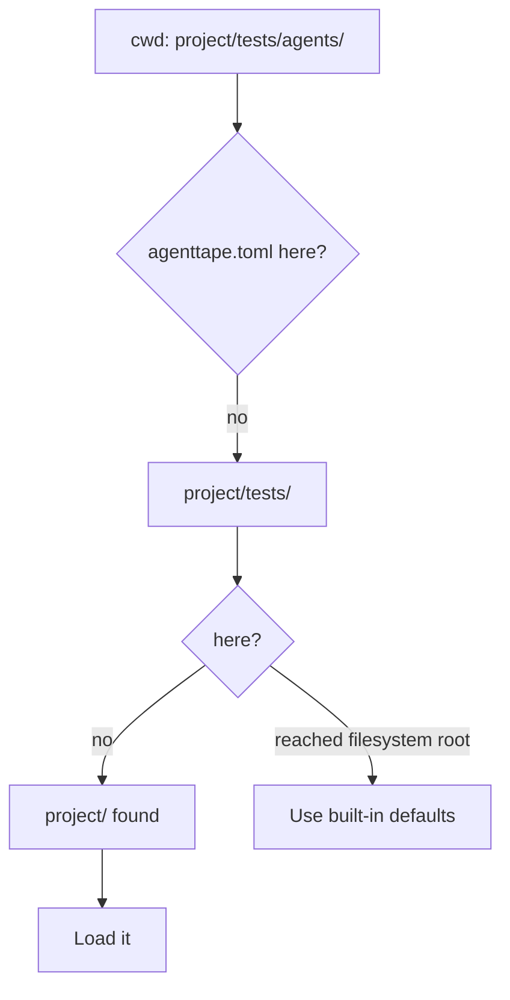

# Configuration

**AgentTape works with zero configuration. When you want project-wide defaults, add an `agenttape.toml` file — it's auto-discovered.**

---

## Do you even need it?

No. Every setting has a default, so AgentTape runs fine with no config file at all. Reach for `agenttape.toml` when you want to stop repeating yourself — a shared cassette directory, a default mode, custom redaction rules.

```bash
agenttape init   # scaffolds a commented agenttape.toml for you
```

---

## How it's discovered

AgentTape walks **up** from the current directory looking for `agenttape.toml`, exactly like `pyproject.toml`. Put it at your project root.



Relative paths inside the file (like `cassette_dir`) resolve relative to the file's location, not your current directory.

---

## A typical config

```toml title="agenttape.toml"
# Where cassettes live (relative to this file)
cassette_dir = "tests/cassettes"

# Default mode when use_cassette() doesn't specify one
default_mode = "none"

# Determinism: what to pin during record/replay
freeze = ["clock", "uuid", "random"]

# Warn if these env vars differ between record and replay
env_snapshot = ["MODEL_TIER", "FEATURE_FLAGS"]

[redact]
# Extra field/header names to scrub (case-insensitive), on top of the built-ins
denylist = ["x-internal-token"]
# Extra regexes to scrub from any string value
regexes = ["cust_[a-z0-9]{12}"]
# Redact email addresses (on by default)
redact_emails = true
```

---

## The settings you'll use most

### `cassette_dir`
Where cassettes are read and written. **Default:** `cassettes`.

### `default_mode`
The mode used when a call doesn't pass one. **Default:** `none`. One of `none`, `once`, `new_episodes`, `all`, `record`. See [Cassette Modes](cassette-modes.md).

### `freeze`
Non-deterministic subsystems to pin. **Default:** `["clock", "uuid", "random"]`. See [Determinism](determinism.md).

### `env_snapshot`
Environment variables to record. If they change on replay, AgentTape warns. **Default:** `[]`.

### `[redact]`
Rules for scrubbing secrets before a cassette is written. Redaction is **on by default** with a built-in denylist and secret-pattern set; these keys *add* to it. See [Redaction](redaction.md).

!!! warning "Redaction config is additive, not a replacement"
    `denylist` and `regexes` *extend* AgentTape's built-in lists — they don't replace them. `Authorization`, `api_key`, OpenAI `sk-...` keys, and emails are already redacted out of the box. The default placeholder is `***REDACTED***`.

---

## Full reference

This page covers the common settings. For every key, its type, and its default, see:

[Configuration Reference →](configuration-ref.md){ .md-button }

---

## FAQ

??? question "Can I override the config for a single call?"
    Yes. Arguments to `use_cassette(...)` always win over the config file — e.g. `use_cassette("x", mode="record", cassette_dir="/tmp")`.

??? question "Why TOML and not YAML/JSON?"
    TOML is parsed with the standard-library `tomllib` (Python 3.11+), with a tiny built-in fallback parser on 3.10 — so config support adds **zero** dependencies, consistent with AgentTape's core promise.

??? question "Is a config file required for the pytest plugin?"
    No. The plugin uses the same defaults. A config file just lets you set a shared `cassette_dir` and redaction rules across the whole suite.

---

## Summary

- Configuration is optional; everything has a default.
- Drop `agenttape.toml` at your project root (use `agenttape init` to scaffold it).
- Common keys: `cassette_dir`, `default_mode`, `freeze`, `env_snapshot`, `[redact]`.
- Per-call arguments always override the file.

[Next: Cassettes →](cassettes.md){ .md-button .md-button--primary }
