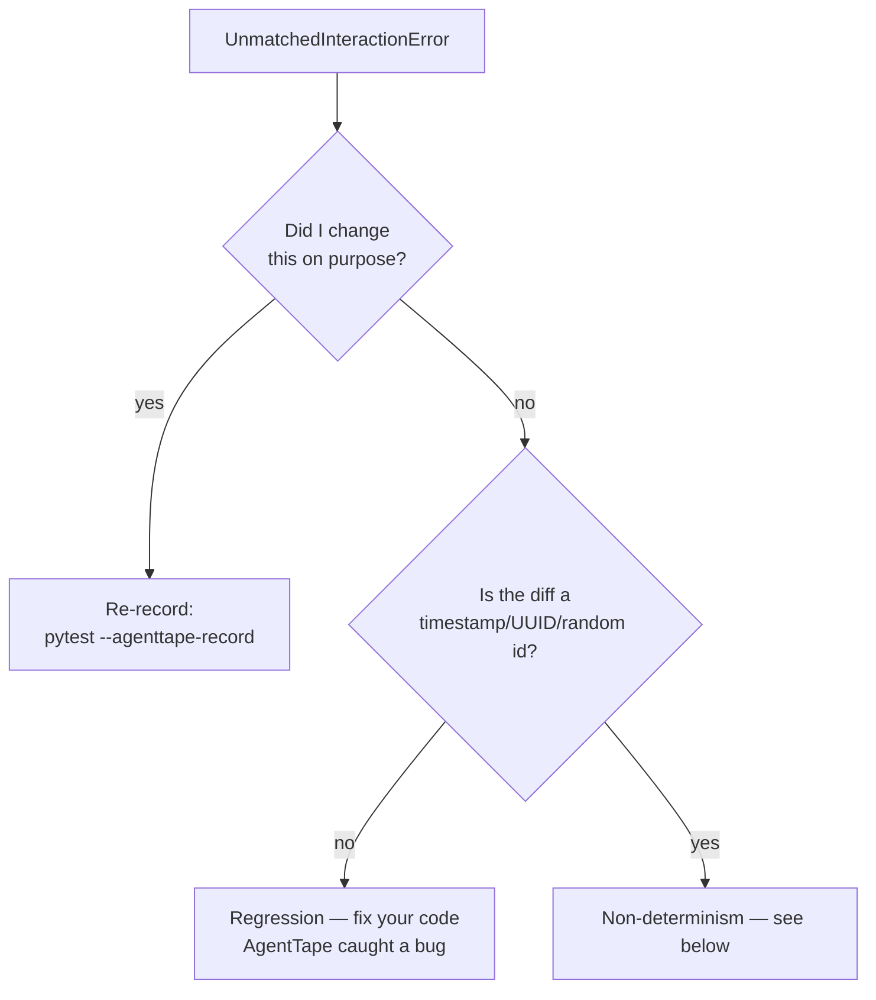

# Debugging

**Replay is strict, so when it fails it fails loudly — and tells you exactly why. This page decodes the common errors and the CLI tools that explain them.**

---

## `UnmatchedInteractionError`

The error you'll see most. It means a request your code made has no matching recording in the cassette.

```text
No recorded tool interaction matched this incoming request (get_weather).
Cassette: cassettes/weather.yaml
Mode: none

Incoming (canonical) request:
    {
      "name": "get_weather",
      "args": { "city": "Paris" }
    }

Closest recorded request:
    {
      "name": "get_weather",
      "args": { "city": "London" }
    }

Field differences (expected = recorded, received = incoming):
  - args.city: expected 'London', received 'Paris'

How to fix:
  * If this request is new and expected, re-record with mode='all'/'new_episodes' or the --agenttape-record flag.
  * If a volatile field is causing the mismatch, add it to ignore_volatile_fields in agenttape.toml.
  * To run this boundary for real during replay, add it to the live={...} set of use_cassette().
```

### Read it top-down

1. **What was called** — the kind and boundary (`tool`, `get_weather`).
2. **Incoming request** — what your code sent *this* run.
3. **Closest recorded request** — the nearest recording (fewest differing fields).
4. **Field differences** — the exact leaf fields that differ.

The diff above says: your code asked for `Paris`, the cassette has `London`. Now decide which of three cases you're in.



| Case | Signal | Fix |
| --- | --- | --- |
| **Intentional change** | You edited the prompt/args/model | Re-record (`pytest --agenttape-record` or `mode="record"`) |
| **Regression** | You didn't mean to change behavior | Revert/fix your code — AgentTape just caught a bug |
| **Non-determinism** | The diff is a timestamp, UUID, or random ID | Freeze it or ignore it (below) |

---

## `CassetteNotFoundError`

You're in `mode="none"` but the cassette file doesn't exist yet. Record it first:

```bash
pytest --agenttape-record        # for pytest
# or run your script once with mode="record"
```

---

## Non-determinism in the diff

If the field difference is a moving value — `"timestamp": ...`, a `uuid`, a `trace_id` — your prompt or request embeds something that changes every run.

| Fix | When |
| --- | --- |
| Enable the [freeze layer](determinism.md) (`freeze = ["clock", "uuid", "random"]`) | The value comes from `time`, `uuid4`, or `random` |
| Add the field to [`ignore_volatile_fields`](configuration-ref.md#ignore_volatile_fields) | It's a header/field that's safe to ignore when matching |
| Mock it yourself with `unittest.mock` | It comes from a custom ID library AgentTape doesn't patch |

---

## `DeterminismDriftWarning`

A whitelisted environment variable changed between record and replay. It's a **warning**, not a failure — a heads-up that your environment differs from when you recorded.

```text
Environment drift for 'MODEL_TIER': recorded 'production' but replay sees 'staging'.
```

**Fix:** align the environment, or remove the variable from [`env_snapshot`](determinism.md#environment-variables) if it's not actually significant.

---

## Streaming errors

Streaming responses can't be recorded deterministically (a token stream isn't reproducible). So:

- **`StreamingReplayError`** — a `stream=True` call was made during offline replay. Re-record without `stream=True`, or mark the `llm` boundary [`live`](mixed-replay.md) to run it for real.
- **`StreamingNotRecordedWarning`** — a streaming call ran live during recording; it was passed through but **not** captured into the cassette.

---

## CLI tools for diagnosis

### `inspect` — what's in this cassette?

```bash
agenttape inspect cassettes/weather.yaml
```

```text
Cassette: cassettes/weather.yaml
version=1 run_id=de5dc0ac-5d8a-4545-8fba-623feaed364d
meta: {"agenttape_version": "0.1.5", "mode": "record"}
freeze: clock, random, uuid

#0 [tool] get_weather  (0.0ms)
  request:  {"name": "get_weather", "args": {"city": "London"}}
  response: {"temp": 15, "condition": "rainy"}

------------------------------------------------------------
1 interactions · 0.0ms · 0+0=0 tokens · cost n/a
```

### `timeline` — what order did things run?

```bash
agenttape timeline cassettes/weather.yaml
```

```text
Timeline: cassettes/weather.yaml
run de5dc0ac · 1 interactions

User
  → Tool      get_weather            |████████████████████████████████████████|      0.0ms
Done

Σ latency 0.0ms · tokens 0 · cost n/a
```

### `diff` — what changed between two runs?

Indispensable with [Partial Replay](mixed-replay.md) to see how a new prompt or model changed behavior:

```bash
agenttape diff cassettes/checkout.yaml cassettes/checkout.derived.yaml
```

### `validate` — is it well-formed and secret-free?

```bash
agenttape validate cassettes/weather.yaml
```

Checks the schema, flags determinism risks, and scans for leaked secrets.

[Full CLI reference →](cli.md){ .md-button }

---

## FAQ

??? question "The error shows no 'Closest recorded request'. Why?"
    There's no recording for that `(kind, boundary)` at all — the cassette has nothing of that type to compare against. Usually it means the call is entirely new (re-record) or the cassette is empty/missing.

??? question "Replay passes locally but fails in CI. What changed?"
    Often an environment difference (a model name or feature flag in the prompt). Add the variable to `env_snapshot` to get a `DeterminismDriftWarning` that pinpoints it, then align CI to match the recording.

??? question "How do I see the full traceback from the CLI?"
    Add `-v`: `agenttape -v inspect cassettes/x.yaml`. Without it, the CLI prints a clean one-line error.

---

## Summary

- `UnmatchedInteractionError` shows the incoming request, the closest recording, and the field-level diff — read it to classify the change.
- Intentional change → re-record. Regression → fix code. Non-determinism → freeze or ignore the field.
- `DeterminismDriftWarning` flags env drift; streaming errors mean a non-recordable stream.
- Use `inspect`, `timeline`, `diff`, and `validate` to understand any cassette.

[Next: Custom Adapters →](adapters.md){ .md-button .md-button--primary }
