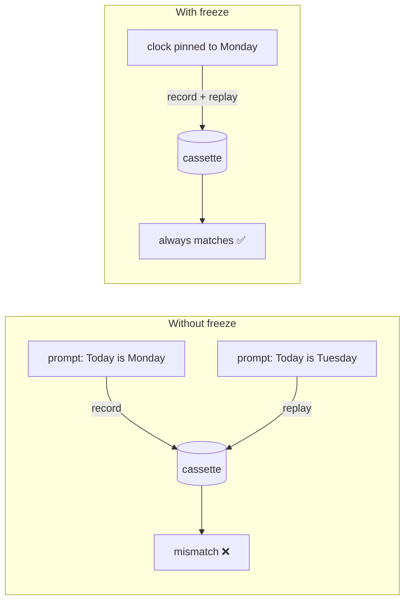

# Determinism

**Agents embed the current time, random UUIDs, and random choices into their prompts. If those change between record and replay, matching breaks. AgentTape's freeze layer pins them so replay reproduces the recorded run exactly.**

---

## The problem it solves

Suppose your system prompt includes "Today is {date}". You record on Monday. On Tuesday the prompt says "Today is Tuesday", which no longer matches the recorded "Today is Monday" — and replay fails with an [`UnmatchedInteractionError`](debugging.md), even though your code didn't change.

The same happens with `uuid4()` request IDs and `random`-driven sampling. Without help, you'd have to mock `time.time()` by hand in every test.



---

## What the freeze layer pins

By default AgentTape freezes three subsystems. While **recording** it captures their base values into the cassette's `meta.freeze`; while **replaying** it restores those exact values, so the run is byte-for-byte reproducible across machines.

| Feature | What's pinned | What's *not* touched |
| --- | --- | --- |
| `clock` | `time.time`, `time.time_ns`, `datetime.now/utcnow/today`, `date.today` | `time.perf_counter`, `time.monotonic` (so latency stays real and `asyncio.sleep` works) |
| `uuid` | `uuid.uuid4()` — replays the recorded sequence | other UUID versions |
| `random` | `random.seed(...)` and NumPy's RNG (if NumPy is imported) | RNGs from other libraries |

!!! info "Latency is always real"
    AgentTape never freezes `perf_counter`, so the `latency_ms` recorded in your cassette reflects the real call duration. It also keeps async timers working — freezing the monotonic clock would make `await asyncio.sleep(...)` hang forever.

---

## Controlling the freeze

Freezing is on by default (the default config enables all three features). Override it per session with `freeze=`:

```python
# Default — clock, uuid, random all pinned
with agenttape.use_cassette("agent"):
    ...

# Pin only UUIDs
with agenttape.use_cassette("agent", freeze=["uuid"]):
    ...

# Disable all freezing
with agenttape.use_cassette("agent", freeze=[]):
    ...
```

Or set the project default:

```toml title="agenttape.toml"
freeze = ["clock", "uuid", "random"]
```

---

## Environment variables

Agents sometimes branch on env vars (`MODEL_TIER`, a feature flag). If one changes between record and replay, your agent can take a different path and fail confusingly. Snapshot them so AgentTape warns you:

```toml title="agenttape.toml"
env_snapshot = ["MODEL_TIER", "FEATURE_FLAGS"]
```

During recording AgentTape saves their values. During replay, if the current value differs, it emits a [`DeterminismDriftWarning`](api.md#warnings) pointing at the exact variable — surfacing a silently-broken environment early instead of leaving you to debug a mysterious mismatch.

---

## The clock caveat (read this if you record against signed APIs)

!!! danger "Freezing the clock affects real calls made *during recording*"
    While recording, the frozen clock is also what your application sees. If a real API requires a live, cryptographically signed timestamp (AWS SigV4, some OAuth flows), the frozen time can make the **real call fail during recording**.

    Exclude `clock` for those cassettes:

    ```python
    with agenttape.use_cassette("aws_agent", freeze=["uuid", "random"]):
        ...
    ```

---

## FAQ

??? question "I use a custom ID library, not `uuid4` — replay still drifts. Why?"
    AgentTape only patches `uuid.uuid4`. If you generate IDs another way (e.g. `ulid`, `nanoid`), freeze them yourself with `unittest.mock.patch` alongside AgentTape, or add the field to [`ignore_volatile_fields`](configuration-ref.md) so matching ignores it.

??? question "Where are the frozen values stored?"
    In the cassette under `meta.freeze` — `base_time`, `base_iso`, `random_seed`, and the recorded `uuids`. That's why replay reproduces them identically on any machine.

??? question "Does freezing affect recording modes too?"
    Yes, by default. During recording the clock is pinned to "now" and that base is saved, so the agent observes the *same* clock value it will see on replay. Disable per-cassette with `freeze=[]` if a real call needs the live clock.

---

## Summary

- The freeze layer pins time, UUIDs, and randomness so prompts that embed them still match.
- It records the base values and restores them on replay — reproducible across machines.
- `perf_counter`/`monotonic` are never frozen, so latency and async timers stay real.
- Snapshot env vars to catch environment drift; exclude `clock` when recording against signed APIs.

[Next: Partial Replay →](mixed-replay.md){ .md-button .md-button--primary }
