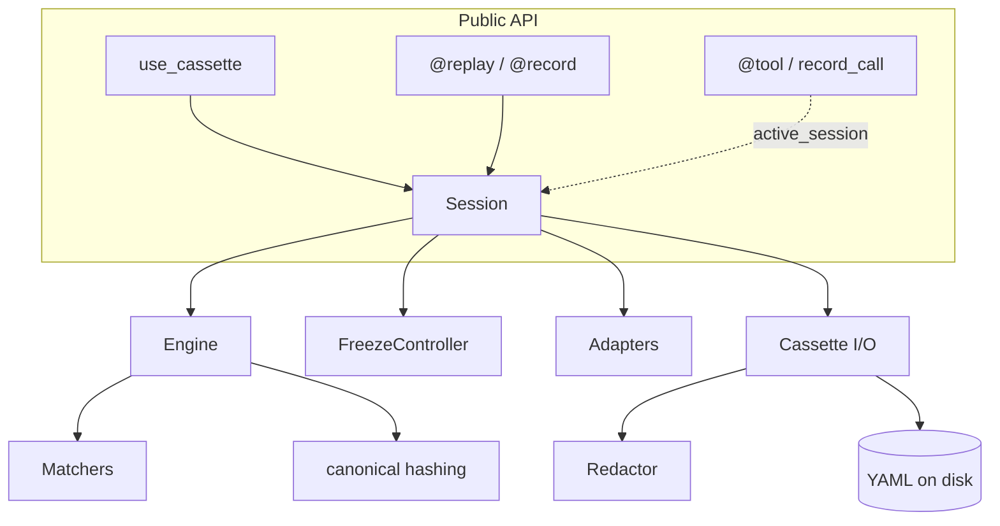
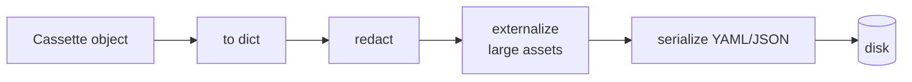

# Internals

**How AgentTape is built, for contributors and the curious. Everything funnels into one internal schema and one decision engine; adapters and helpers are thin translators around them.**

---

## The non-negotiable: zero core dependencies

The core engine has `dependencies = []`. It cannot rely on `requests`, `pydantic`, `pyyaml`, or even `typing_extensions` — it must run on a bare Python 3.10+ install.

!!! abstract "Why"
    AgentTape is a *testing* tool. If it forced, say, `pydantic>=2`, it would break any project still on `pydantic 1.x` — the very projects it's meant to test. Adding AgentTape must never cause a version conflict.

How that's achieved:

| Concern | Solution |
| --- | --- |
| YAML | A tiny custom block-YAML emitter/parser (`yaml_io.py`) covering just the cassette subset. PyYAML is optional and used if present. |
| TOML | Stdlib `tomllib` on 3.11+, a tiny `_MiniToml` fallback on 3.10. |
| Data model | Standard library `dataclasses`, not Pydantic. |

---

## The architecture at a glance

---

## `Session` — the orchestrator

`recorder.py`. A `Session` ties together the `Config`, the loaded `Cassette`, a `FreezeController`, an `Engine`, and the installed adapters. The public entry points (`use_cassette`, `@replay`, `@record`) are thin wrappers around it.

A **ContextVar-based active-session stack** (`active_session()`) lets adapters and the `@tool` decorator find the current engine at call time without threading it through every call. ContextVar (not thread-local) is deliberate: each thread *and* each asyncio task gets an independent view, so two sessions opened concurrently in one event loop don't corrupt a shared stack.

- **On `__enter__`:** turn the freeze layer on, push onto the stack, install every available adapter.
- **On `__exit__`:** uninstall adapters, pop the stack, restore the freeze layer, then `_maybe_write()` the cassette (only if the mode calls for it).

---

## `Engine` — the decision core & guardrail

`engine.py`. Adapters and decorators call `engine.intercept(kind, request, boundary=, executor=)` (and `aintercept` for async). The engine decides **replay vs. execute** from `ModeFlags` plus the `live`/`frozen` sets, then either reconstructs the recorded response or runs `executor()` and records the result.

Subtleties worth knowing:

- **Re-entrancy depth** (a `ContextVar`): while an executor runs we're "inside" a boundary, so a nested interception (e.g. the httpx fallback firing during an OpenAI call the OpenAI adapter already wrapped) passes through instead of double-recording. The outermost boundary is captured. It's a ContextVar so concurrent async tasks each carry independent depth.
- **`build_output()`** decides what's persisted per mode: `new_episodes` merges recorded + executed; `record`/`all`/`once` write only what executed; `none` with a live boundary writes the full served timeline (the *derived* cassette).
- **`UnmatchedInteractionError`** is built with the closest recorded request and field-level diffs for a precise message.

---

## `Matchers` & `canonical`

`matchers.py` + `canonical.py`. A matcher reduces a request to a comparison key; the engine indexes recordings by `(kind, boundary, key)`. Canonicalization drops volatile fields, recurses through nested structures, and renders to JSON with sorted keys and compact separators, then SHA-256 hashes it — so the key is identical across machines and Python versions. `ordered` matchers return a constant sentinel so matching falls through to call order.

---

## `FreezeController` — determinism

`freeze.py`. Pins `clock`, `uuid`, and `random` (plus optional NumPy and an env snapshot). Base values live in `cassette.meta["freeze"]` so replay reproduces them everywhere.

- The global callables (`time.time`, `datetime`, `uuid.uuid4`) are patched **once** via a reference-counted, lock-guarded installer; the patched functions **dispatch through the controller active in the current ContextVar**, so concurrent sessions don't stomp each other.
- The frozen clock returns a **constant** `base_time` — it does not advance per call. `time.perf_counter` and `time.monotonic` are never frozen, so `latency_ms` stays real and async timers keep working.
- Datetime freezing is "freezegun-lite": it swaps the real `datetime`/`date` classes in every already-imported module that holds a direct reference.

---

## The I/O pipeline (ordering matters)

`cassette.py` + `yaml_io.py` + `assets.py` + `redaction.py`. Writing a cassette is deliberately ordered:

Redaction runs **before** anything is written, so secrets never touch the filesystem. Large binary payloads are offloaded to a sibling assets directory instead of being inlined.

---

## The three interception mechanisms

A change usually belongs to exactly one of these — know which:

1. **Transport adapters** (`adapters/`) — patch a library's client; the only mechanism that can *replay* a substituted response. OpenAI, httpx/requests fallback, LangGraph.
2. **Boundary decorators** (`boundaries.py`) — `@tool`/`@retrieval`/`@memory_*` and low-level `record_call`. The "almost-no-code" way to make any function a recorded boundary.
3. **`AgentTape` callback** (`callbacks.py`) — a duck-typed listener for frameworks that expose hooks (LangChain, LlamaIndex). Observational/record-only — it can't substitute a return value, so deterministic replay still relies on the transport adapters.

---

## Summary

- Zero core dependencies → custom YAML/TOML parsers, dataclasses over Pydantic.
- `Session` orchestrates; `Engine` decides replay-vs-execute and is the side-effect guardrail.
- ContextVars (active session, re-entrancy depth, freeze dispatch) make it concurrency-safe.
- The write pipeline redacts before serializing, so secrets never reach disk.

[Next: Performance →](performance.md){ .md-button .md-button--primary }
