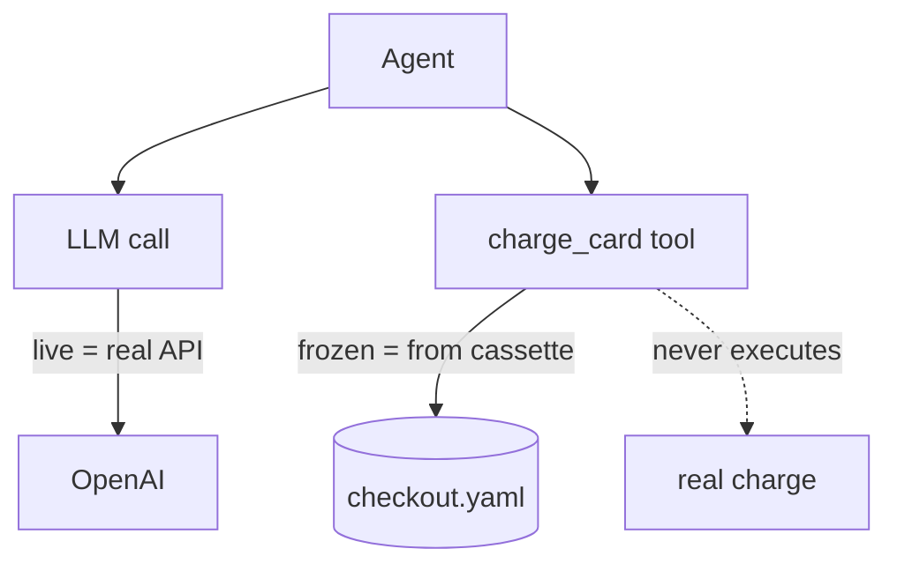
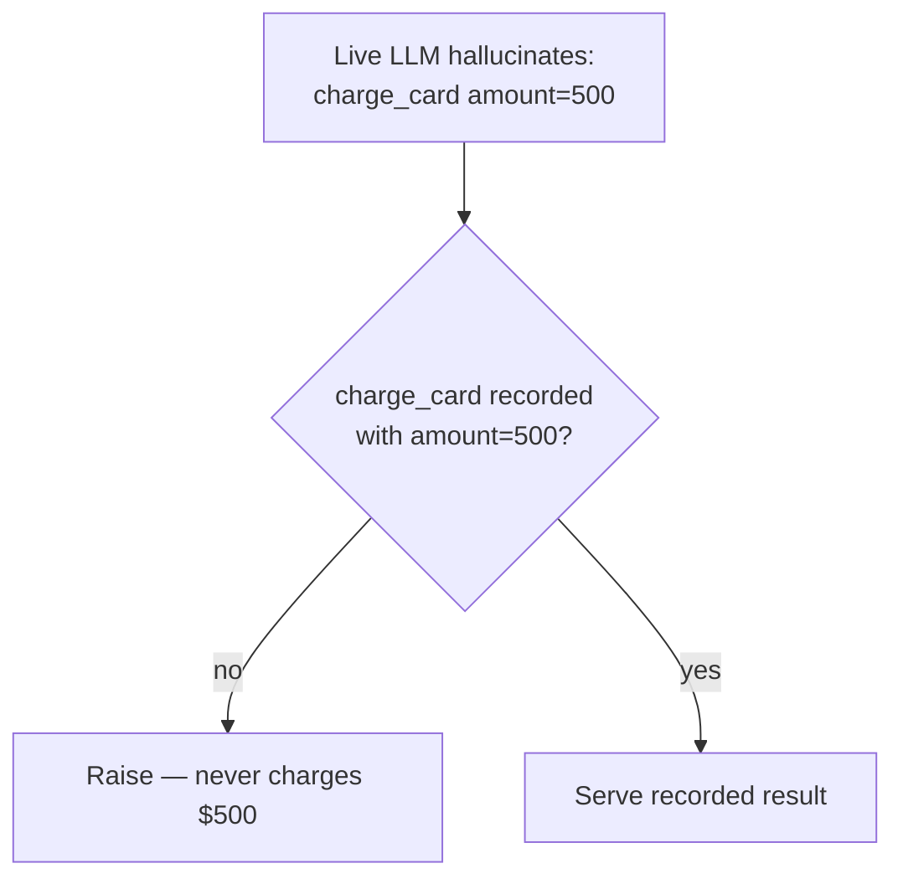

# Partial Replay

**Run *some* boundaries live while keeping the rest frozen. The classic use: let the LLM hit the real API to test a new prompt, while every tool stays mocked from the cassette — so you iterate fast with zero side effects.**

---

## The problem it solves

You have a cassette of a complex run: the agent searched a vector DB, used a calculator, and wrote a row to PostgreSQL. Now you want to test whether a new system prompt — or upgrading `gpt-3.5` to `gpt-4o` — improves the agent.

Your options *without* partial replay are both bad:

- **Normal replay** fails instantly: the new prompt doesn't match the recorded one.
- **Re-record everything** (`mode="all"`) re-runs the real PostgreSQL write. Dangerous.

Partial replay is the third way: *"Run the LLM for real, but serve every tool from the cassette."*

---

## How it works

Pass a `live` set to `use_cassette`. Anything in the set executes for real; everything else replays from the cassette.

```python
import agenttape

# Only the LLM runs for real. Every tool is served frozen from the cassette.
with agenttape.use_cassette("checkout", live={"llm"}):
    result = run_agent()
```



!!! success "What happens"
    1. The agent sends the **new** prompt to OpenAI — a real call that costs money.
    2. OpenAI replies and decides to call `charge_card`.
    3. `charge_card` is **not** in `live`, so AgentTape serves its result from the cassette.
    4. Zero side effects — no real charge.

---

## Derived cassettes: your original is never touched

When a live boundary runs in `mode="none"`, AgentTape writes the new run to a **separate** file — `name.derived.yaml` — and leaves your original cassette untouched. Diff them to see exactly what your change did:

```bash
agenttape diff cassettes/checkout.yaml cassettes/checkout.derived.yaml
```

This is the honest framing: a live boundary **really executes** (real cost), so the result is *derived*, not a deterministic replay of the original.

---

## What the tokens mean

The strings in `live` (and `frozen`) match an interaction's **kind** or **boundary name**:

| Token | Matches |
| --- | --- |
| `"llm"` | All LLM calls |
| `"tool"` | All `@agenttape.tool` functions |
| `"charge_card"` | Only the tool named `charge_card` |
| `"*"` | Everything |

```python
# Run the LLM and the search tool live; keep everything else frozen
with agenttape.use_cassette("rag", live={"llm", "search_docs"}):
    ...
```

---

## `live` vs `frozen` — the inverse

`frozen` is the opposite of `live`: it forces specific boundaries to replay from the cassette **even in a recording mode**. Use it to record a fresh run while protecting a dangerous tool.

```python
# Record a new session, but DO NOT run the real charge — replay it from the cassette.
with agenttape.use_cassette("checkout", mode="record", frozen={"charge_card"}):
    run_agent()
```

!!! warning "Pick one"
    `live` and `frozen` are mutually exclusive — pass one or the other, not both. `live` = "run only these for real"; `frozen` = "replay only these."

---

## Strict adherence keeps you safe

A live LLM might call a tool the original run didn't, or call it with different arguments. Because that tool is **not** live, AgentTape will **not** execute it for real — it raises [`UnmatchedInteractionError`](debugging.md) and fails the test.



A hallucinating model cannot wipe your database during a partial-replay test. That's the guarantee.

---

## A perfect fit: RAG iteration

RAG apps are the textbook case — freeze the expensive retrieval, iterate the synthesis prompt live:

```python
with agenttape.use_cassette("rag_test", live={"llm"}):
    answer = agent.run("How do I reset my password?")
```

Retrieval is served from the cassette (no re-embedding, no vector DB hit); only the LLM runs live. See [Recording Vector Stores](recording-vector-stores.md).

---

## FAQ

??? question "Does partial replay overwrite my cassette?"
    No. In `mode="none"`, a live run writes `name.derived.yaml` and leaves the original intact.

??? question "Can I run everything live but freeze just one tool?"
    Yes — use `frozen={"charge_card"}` with a recording mode, or `live={"*"}` minus what you want frozen (use `frozen` for that case, since it's the inverse).

??? question "Why did my partial-replay run fail when the LLM called a new tool?"
    Because the new tool call isn't in the cassette and isn't `live`, so AgentTape refused to run it for real. Either add that tool to `live` (accepting the real side effect) or re-record.

---

## Summary

- `live={...}` runs selected boundaries for real and serves the rest from the cassette.
- The classic use is `live={"llm"}` to test prompts/models with tools safely frozen.
- Results go to a `.derived.yaml` file; your original is never mutated.
- `frozen={...}` is the inverse; the two are mutually exclusive.
- A live LLM can't trigger an unrecorded frozen tool — AgentTape fails loud instead.

[Next: Redaction →](redaction.md){ .md-button .md-button--primary }
