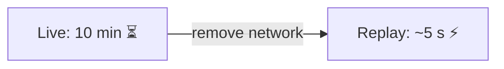
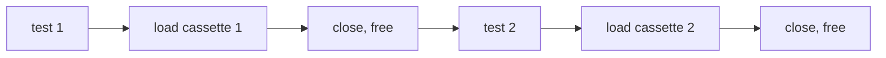

# Performance

**Replay is CPU-only and local, so it's orders of magnitude faster than live calls. This page covers the numbers, the YAML parser trade-off, and memory behavior.**

---

## Replay speed

In `mode="none"`, AgentTape does dictionary lookups, string hashing, and YAML parsing — no network at all.

| | Live call | Replayed call |
| --- | --- | --- |
| Typical OpenAI request | 1–5 s | **< 5 ms** |
| Source of the time | Network + model | Local hash + lookup |

Because network latency disappears, a suite that takes **10 minutes** against live APIs commonly finishes in **under 5 seconds** on replay.



!!! warning "Replay is *not* a latency benchmark"
    The recorded `latency_ms` reflects the real call's duration (AgentTape never freezes `perf_counter`), but replay itself returns almost instantly. Don't use replay to measure real-world performance.

---

## The YAML parser trade-off

To keep zero dependencies, AgentTape ships a **pure-Python** YAML emitter/parser tuned for cassette shapes. For the vast majority of cassettes it's plenty fast.

The exception is **large** cassettes — e.g. a RAG step that captured 10 MB of retrieved text. Pure-Python parsing of a multi-megabyte file becomes the bottleneck when a session starts.

**Fix:** install the optional PyYAML extra. AgentTape then uses its C-accelerated loader automatically.

```bash
pip install "agenttape[yaml]"
```

| Cassette size | Default (stdlib) | With `[yaml]` |
| --- | --- | --- |
| Typical (KB–low MB) | Fast | Fast |
| Large (multi-MB) | Can be slow to load | C-accelerated |

!!! tip "Keep cassettes lean"
    Before reaching for the faster parser, consider whether you need to record megabytes of context at all. Large binary payloads are already offloaded to an assets sidecar; trimming captured text keeps cassettes both fast *and* readable.

---

## Memory footprint

AgentTape loads a cassette into memory only while its `Session` is open, and frees it on exit. A 1,000-test suite where each test uses a different cassette holds **one** cassette in memory at a time — so the pytest plugin's overhead stays low regardless of suite size.



---

## FAQ

??? question "Does the freeze layer slow things down?"
    Negligibly. It patches a handful of stdlib callables once per process (reference-counted) and dispatches through a ContextVar. The cost is dwarfed by removing network latency.

??? question "Will many concurrent sessions contend?"
    Patches are installed once and shared (ref-counted, lock-guarded); per-session state lives in ContextVars, so concurrent asyncio tasks and threads don't serialize on a global lock during interception.

??? question "How do I see where time went in a recorded run?"
    `agenttape timeline cassettes/x.yaml` renders an ASCII waterfall with per-interaction latency, and `agenttape inspect` totals latency and tokens.

---

## Summary

- Replay eliminates network latency: ~milliseconds per call, often a 100× faster suite.
- The default pure-Python YAML parser is fine until cassettes get large; then `pip install "agenttape[yaml]"`.
- Cassettes are loaded one at a time, so memory stays flat across big suites.
- Replay speed is not a real-latency benchmark — recorded `latency_ms` is the real number.

[Next: Extending AgentTape →](extending.md){ .md-button .md-button--primary }
