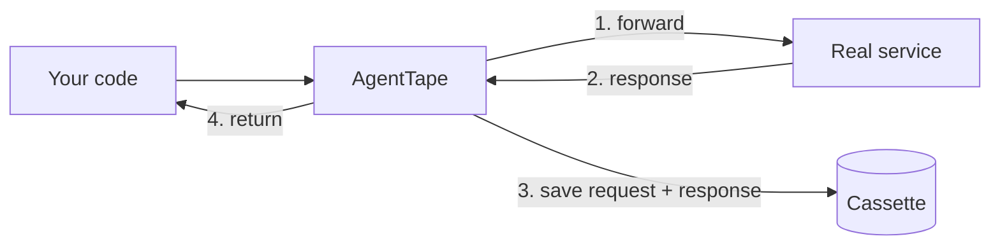
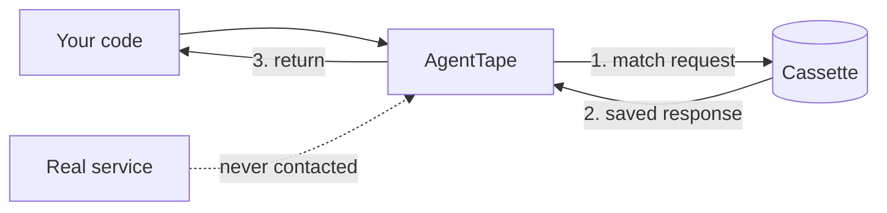
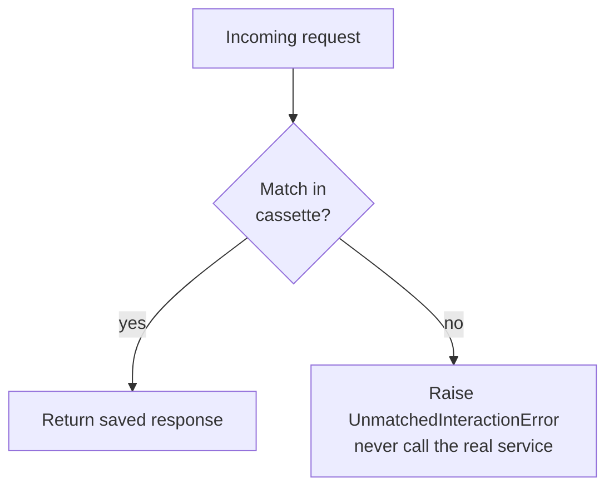

# Record vs Replay

**AgentTape has two phases. Recording calls the real world and saves it. Replay reconstructs it offline. Understanding the difference is the whole mental model.**

---

## The two phases at a glance

| | **Record** | **Replay** |
| --- | --- | --- |
| Role | Passthrough observer | Air-gapped simulator |
| Network | Real requests | Blocked |
| API keys | Required & valid | Not needed |
| Cost | Billed per call | Free |
| Tools | Execute for real | Mocked |
| Side effects | **Happen** | **Never happen** |
| Cassette | Written | Read |

---

## The record phase

While recording, AgentTape is a **passthrough observer**. For each intercepted call it:

### When to record

You should record **rarely** — only when the recorded behavior is intentionally stale:

- [x] Writing a brand-new test.
- [x] You deliberately changed the prompt, model, or tools.
- [x] The real API changed and you want the new baseline.

### What recording costs you

!!! danger "Recording runs everything for real"
    - Network requests hit live servers — API keys must be valid.
    - You are billed for usage.
    - Tools execute their actual code, so **side effects happen**: databases get written, emails get sent, cards get charged.

    Record against staging/sandbox services when you can, or freeze dangerous tools with [Partial Replay](mixed-replay.md).

---

## The replay phase

While replaying, AgentTape is an **air-gapped simulator**. For each intercepted call it:

### When to replay

Almost always:

- [x] Running tests locally.
- [x] Running tests in CI.
- [x] Reproducing a failure without paying for API calls.
- [x] Refactoring the code around your agent.

### What replay guarantees

!!! success "Replay is safe and deterministic"
    - Network requests are blocked.
    - API keys aren't needed (or even read).
    - Usage is free.
    - Tools are mocked — **zero side effects**.

---

## Strict matching: the safety net

In replay, AgentTape never guesses. If your code asks for a "Chocolate Cake" recipe but the cassette only has "Vanilla Cake," it does **not** fall back to the network. It raises [`UnmatchedInteractionError`](debugging.md) immediately and tells you what differed.

This strictness is the point: a test that drifted should fail loudly, not silently charge a card because an assertion changed.

!!! note "The one exception"
    `mode="new_episodes"` records *new* requests while replaying known ones, and [Partial Replay](mixed-replay.md) lets you mark specific boundaries `live`. Both are explicit opt-ins — the default `mode="none"` never touches the network.

---

## Who picks the phase?

You don't set "record" or "replay" directly — you set a **mode**, and the mode decides per request. `mode="record"` always records; `mode="none"` always replays; `once` and `new_episodes` mix the two.

[How modes map to phases →](cassette-modes.md){ .md-button }

---

## FAQ

??? question "Does replay re-run my prompt against the model?"
    No. Replay reconstructs the **recorded bytes**. It does not re-execute the LLM with your current prompt. The moment an input to a `live` boundary changes, that boundary really executes (real cost) and a separate *derived* cassette is written — your original is never mutated. See [Partial Replay](mixed-replay.md).

??? question "What if I forget and leave mode='record' in CI?"
    CI would hit real services and rewrite cassettes. Keep `mode="none"` as the default (it already is) and gate recording behind an explicit flag like `pytest --agenttape-record`. The pytest plugin does exactly this.

---

## Summary

- **Record**: passthrough, online, real side effects, writes the cassette. Do it rarely.
- **Replay**: simulator, offline, zero side effects, reads the cassette. Do it always.
- Replay matches strictly and fails loud — it never silently calls the real service.

[Next: Cassette Modes →](cassette-modes.md){ .md-button .md-button--primary }
