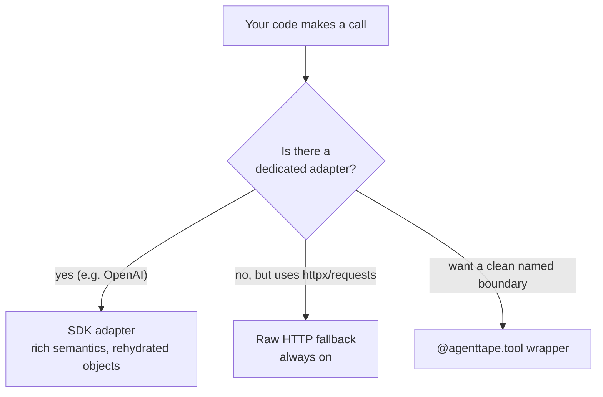

# Recording APIs

**Agents talk to LLM providers and third-party services over HTTP. AgentTape captures those calls three ways — pick the one that fits.**

---

## Three interception layers



| Layer | Captures | When it applies |
| --- | --- | --- |
| **SDK adapter** | Model, messages, token usage; rehydrates into real SDK objects | The SDK has a dedicated adapter (OpenAI today) |
| **Raw HTTP fallback** | Method, URL, headers, body, status | Any call through `httpx` or `requests` |
| **`@agenttape.tool`** | Whatever your function returns | You want a semantic, named boundary |

---

## Layer 1 — Dedicated SDK adapters

If the matching extra is installed, AgentTape intercepts the SDK **automatically**. No code changes — just wrap your code in a session.

```python
import agenttape
from openai import OpenAI

with agenttape.use_cassette("api_test", mode="record"):
    client = OpenAI()
    client.chat.completions.create(
        model="gpt-5.5",
        messages=[{"role": "user", "content": "Hello"}],
    )
```

The OpenAI adapter covers `chat.completions.create`, `responses.create`, and `embeddings.create` (sync **and** async). It records token `usage`, and on replay rehydrates the recorded data back into a real `ChatCompletion` object — so `resp.choices[0].message.content` works offline, even without `openai` installed.

!!! tip "Prefer adapters when one exists"
    A dedicated adapter captures semantic metadata (model, usage) that a generic HTTP capture would miss, and gives you back real SDK objects. Install it with `pip install "agenttape[openai]"`.

---

## Layer 2 — The raw HTTP fallback (always on)

Any SDK built on **`httpx`** or **`requests`** is captured automatically, even with no dedicated adapter. These fallback adapters are always active whenever those libraries are importable — you don't install or enable anything.

```python
import agenttape
import httpx

with agenttape.use_cassette("github", mode="record"):
    r = httpx.get("https://api.github.com/users/octocat")
    print(r.json()["name"])   # replays offline next time
```

How HTTP matching works:

- The request is matched on **method + URL + body + non-volatile headers**.
- Secret and volatile headers (`Authorization`, `Cookie`, `User-Agent`, `Date`, request IDs, …) are **dropped from the recording** — so they neither leak to disk nor destabilize matching.
- JSON and form bodies are captured **structurally** (not as one opaque blob), so [redaction](redaction.md) can see nested secrets and matching survives key reordering.

!!! note "Why some response headers disappear"
    The recorded body is the *decoded* payload. Transport headers describing the wire encoding (`Content-Encoding`, `Content-Length`, `Transfer-Encoding`) are dropped from the recorded response — keeping them would make the client try to gunzip an already-decompressed body on replay.

---

## Layer 3 — Wrap it as a tool

When you want a clean, named, semantic boundary — or you're calling something that isn't plain HTTP — wrap the call in a function and decorate it.

```python
import agenttape
import requests

@agenttape.tool
def get_github_user(username: str) -> dict:
    resp = requests.get(f"https://api.github.com/users/{username}")
    resp.raise_for_status()
    return resp.json()
```

During recording the request runs for real. During replay, `get_github_user` returns the saved dict and the network is never touched. The cassette shows a tidy `tool: get_github_user` interaction instead of a raw HTTP entry. See [Tools](tools.md).

---

## Which layer should I use?

!!! tip "Rule of thumb"
    - **LLM provider with an adapter** → let the adapter handle it (install the extra).
    - **Some other REST API your agent hits directly** → the raw HTTP fallback already captures it; do nothing.
    - **You want a readable, named boundary or domain-level mocking** → wrap it with `@agenttape.tool`.

---

## FAQ

??? question "Do I need `agenttape[openai]` if I only use httpx?"
    No. The httpx/requests fallback captures the traffic regardless. But for OpenAI specifically, the dedicated adapter gives you token usage and real SDK objects, so it's worth installing.

??? question "The same OpenAI call is captured by both the adapter and httpx — do I get duplicate entries?"
    No. The engine has a re-entrancy guard: while the OpenAI adapter's call executes, the nested httpx call passes through instead of being recorded again. The outermost boundary is the one captured.

??? question "Can I record an API that uses raw sockets / a custom transport?"
    The HTTP fallback only covers `httpx` and `requests`. For anything else, wrap the call with `@agenttape.tool`, or write a [custom adapter](adapters.md).

---

## Summary

- Three layers: dedicated SDK adapters, the always-on httpx/requests fallback, and `@agenttape.tool`.
- Adapters capture rich semantics and rehydrate SDK objects; install the extra to use them.
- The raw HTTP fallback captures any httpx/requests call, dropping secret/volatile headers.
- Wrap a call as a tool when you want a clean, named, domain-level boundary.

[Next: Recording Databases →](recording-databases.md){ .md-button .md-button--primary }
