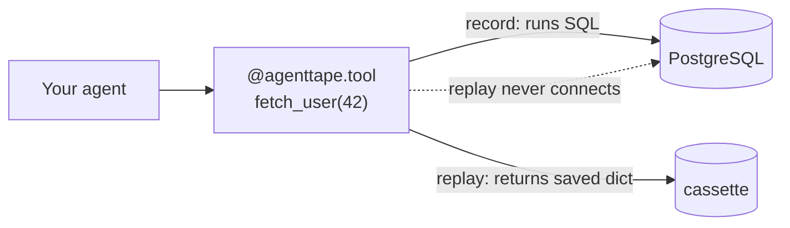

# Recording Databases

**Don't mock the database driver. Record the *boundary* — the function that talks to the database — with `@agenttape.tool`. Reads and writes become fast, offline, side-effect-free mocks on replay.**

---

## Why not intercept the driver?

AgentTape deliberately does **not** hook the PostgreSQL wire protocol or MongoDB sockets. Drivers maintain connection pools, binary formats, and streaming cursors that don't serialize cleanly to YAML. Intercepting there is brittle and lossy.

Instead, mock one level up — at the **semantic boundary** between your app and the database.



---

## Reading from a database

```python
import agenttape
import psycopg2

@agenttape.tool
def fetch_user_record(user_id: int) -> dict | None:
    conn = psycopg2.connect("dbname=production")
    cur = conn.cursor()
    cur.execute("SELECT id, name, email FROM users WHERE id = %s", (user_id,))
    row = cur.fetchone()
    return {"id": row[0], "name": row[1], "email": row[2]} if row else None
```

=== "Record"

    AgentTape runs `fetch_user_record(42)`, connects to PostgreSQL, runs the query, and saves `args={user_id: 42}` plus the returned dict.

=== "Replay"

    AgentTape intercepts `fetch_user_record(42)`. It **never** runs the inner code, never imports `psycopg2`, never connects. It returns the saved dict.

---

## Writing to a database

The same pattern makes destructive writes safe in tests:

```python
@agenttape.tool
def update_user_status(user_id: int, status: str) -> bool:
    conn = psycopg2.connect("dbname=production")
    cur = conn.cursor()
    cur.execute("UPDATE users SET status = %s WHERE id = %s", (status, user_id))
    conn.commit()
    return True
```

On replay, `update_user_status("active", 42)` returns `True` **without modifying the real database**. This is exactly what makes AgentTape safe for CI — a test can't accidentally mutate production.

!!! danger "Recording still writes for real"
    Recording executes the function, so the `UPDATE` really runs. Record against a disposable/staging database, or use [`frozen={"update_user_status"}`](mixed-replay.md#live-vs-frozen-the-inverse) to record the rest of a run while serving the write from the cassette.

---

## Best practices

!!! tip
    - **Return plain data.** Convert rows, cursors, and ORM models to dicts/lists *before* returning. AgentTape serializes the return value to YAML — a live cursor won't survive.
    - **Keep boundaries thin.** Don't wrap a 50-line handler with one query inside. Extract the query into a small function and wrap that.
    - **Connection handling stays inside the boundary** (or global), so it isn't part of the matched arguments. See [the golden rule](tools.md#the-golden-rule-serialize-at-the-boundary).

---

## FAQ

??? question "What about an ORM like SQLAlchemy?"
    Same approach — wrap the function that performs the query and returns results, and return dicts rather than ORM instances. AgentTape doesn't care which library you use; it only records the boundary's inputs and outputs.

??? question "My read returns thousands of rows — is that a problem?"
    It just makes the cassette larger. That's fine for correctness; if a cassette gets very large, see [Performance](performance.md) for the faster YAML backend.

??? question "Can I test error paths, like a unique-constraint violation?"
    Yes — AgentTape records raised exceptions too, and re-raises them (as the real type when importable) on replay. You can also hand-edit the cassette to inject an `error`. See [Working Offline](working-offline.md#faking-errors).

---

## Summary

- AgentTape doesn't intercept DB drivers — it records the function around the query.
- `@agenttape.tool` makes reads and writes replayable and side-effect-free.
- Return serializable data (dicts/lists), not cursors or ORM models.
- Recording runs the query for real; replay never connects.

[Next: Recording Vector Stores →](recording-vector-stores.md){ .md-button .md-button--primary }
