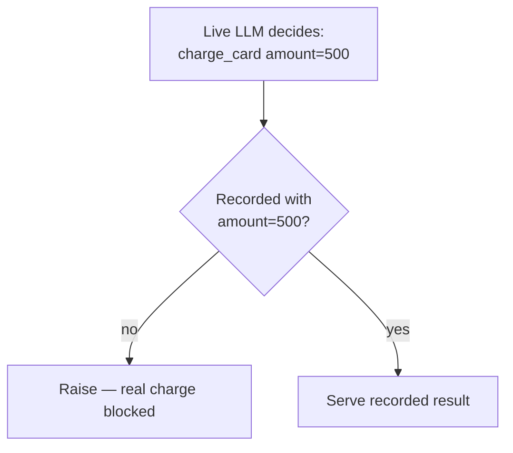

# Recording Tools

**A deeper guide to capturing tool executions: serialization rules, the boundary decorators, the low-level hook, and how tools behave under partial replay.**

New to tools? Start with the [Tools concept page](tools.md). This guide covers the edge cases.

---

## The golden rule, restated

AgentTape serializes a tool's arguments and return value to YAML. If it can't represent a value cleanly, it falls back to `str(value)` — and for most objects that includes a memory address that changes every run, which breaks matching on replay.

```python
# str(db_conn) -> "<Connection object at 0x7f3a…>"   ← different every run
# str(user)    -> "<User object at 0x55b2…>"          ← match fails on replay
```

So: **pass and return primitives at the boundary** — `str`, `int`, `float`, `bool`, `list`, `dict`, `None`.

=== " Don't"

    ```python
    @agenttape.tool
    def get_user_status(db: Connection, user: User) -> None:
        ...   # neither argument serializes stably
    ```

=== " Do"

    ```python
    @agenttape.tool
    def get_user_status(user_id: int) -> str:
        db = get_global_db()          # connection lives inside the boundary
        return db.query_status(user_id)  # returns a plain string
    ```

!!! note "What AgentTape *can* serialize for you"
    Beyond plain JSON types, the engine converts common scalars faithfully: `datetime`/`date` → ISO strings, `Decimal` → string, `UUID` → string, `Enum` → its value, `set` → sorted list, and Pydantic models via `model_dump()`. Cyclic graphs are broken with a `<cycle>` marker rather than overflowing. Binary `bytes` are preserved losslessly via the assets sidecar.

---

## The four decorators

All behave identically at runtime; they only set the `kind` label, which makes cassettes and [timelines](cli.md#timeline) readable and filterable.

| Decorator | `kind` | Use for |
| --- | --- | --- |
| `@agenttape.tool` | `tool` | Default: actions, APIs, payments, calculators |
| `@agenttape.retrieval` | `retrieval` | RAG / search lookups |
| `@agenttape.memory_read` | `memory_read` | Reading agent long-term memory |
| `@agenttape.memory_write` | `memory_write` | Writing agent long-term memory |

```python
@agenttape.memory_write
def save_preference(user_id: str, key: str, value: str) -> None:
    preferences_db.set(user_id, key, value)

@agenttape.tool(name="charge")   # override the recorded boundary name
def charge_card(amount: int) -> dict:
    ...
```

Decorate an `async def` and it's awaited normally — sync and async are both supported.

---

## The low-level hook: `record_call`

Sometimes you can't add a decorator — you're inside a framework, or you only have a call site. [`record_call`](api.md#record_call) routes a single boundary crossing through the active session with an explicit request payload.

```python
import agenttape

result = agenttape.record_call(
    "tool",
    {"name": "weather", "args": {"city": "London"}},
    executor=lambda: weather_client.fetch("London"),
    boundary="weather",
)
```

Outside a session it just calls `executor()`. This is the same primitive the decorators and the [`AgentTape` callback](api.md#agenttape-callback-object) use under the hood.

---

## Tools under Partial Replay

When you run with `live={"llm"}` ([Partial Replay](mixed-replay.md)), the LLM hits the real API but **tools stay frozen**. If the live model calls a tool with arguments that aren't in the cassette, AgentTape does **not** execute it — it raises [`UnmatchedInteractionError`](debugging.md).



A hallucinating model can't cause real-world damage during a partial-replay test. To intentionally allow a tool to run live, add it to the `live` set (`live={"llm", "charge_card"}`) — accepting the real side effect.

---

## Best practices

!!! tip
    - **Wrap only boundaries** (network/disk/DB/payment), never pure logic.
    - **Return primitives**; convert models/cursors to dicts first.
    - **Name tools explicitly** with `@tool(name=...)` if the function name is generic, so `live`/`frozen` tokens and cassettes are clear.
    - **Keep boundaries atomic** — one side effect per decorated function.

---

## FAQ

??? question "Can I wrap a third-party function I don't own?"
    Yes: `wrapped = agenttape.tool(name="search")(third_party.search)` and call `wrapped(...)`. Or use `record_call` at the call site.

??? question "Two tools have the same function name in different modules — will they collide?"
    Recordings are keyed by `(kind, boundary, request)`. Give them distinct names via `@tool(name=...)` to keep `live`/`frozen` targeting and cassettes unambiguous.

??? question "Does the decorator slow down production code?"
    Outside a session it's a thin pass-through to the original function — negligible overhead. Interception only happens inside a `use_cassette` block.

---

## Summary

- Pass and return serializable primitives so matching stays stable.
- `tool` / `retrieval` / `memory_read` / `memory_write` differ only in their `kind` label.
- `record_call` is the low-level hook when you can't decorate.
- Under partial replay, frozen tools never execute for real — unmatched calls fail loud.

[Next: Working Offline →](working-offline.md){ .md-button .md-button--primary }
