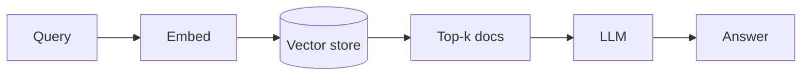
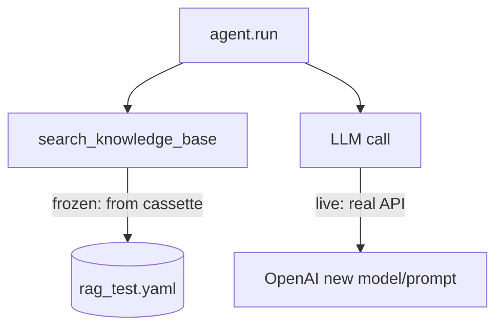

# Recording Vector Stores

**RAG agents retrieve context before they answer. Wrap the retrieval function with `@agenttape.retrieval` to freeze the documents — so your tests aren't at the mercy of a changing index.**

---

## Why RAG is hard to test

A RAG answer depends on a chain of moving parts:



If the vector store's contents change, the retrieved docs change, so the LLM's answer changes — and your test breaks for reasons that have nothing to do with your code. Freezing retrieval cuts the chain at the right place.

---

## Wrap the retrieval boundary

Like databases, you don't intercept Pinecone or FAISS at the wire level. Wrap the function that does the lookup:

```python
import agenttape
import pinecone

@agenttape.retrieval
def search_knowledge_base(query: str, top_k: int = 3) -> list[str]:
    embedding = get_embedding(query)            # may hit OpenAI
    index = pinecone.Index("my-index")
    results = index.query(vector=embedding, top_k=top_k, include_metadata=True)
    return [m["metadata"]["text"] for m in results["matches"]]
```

On record, AgentTape saves the `query` and the returned text chunks. On replay, your agent receives the **exact same chunks** it saw months ago — even if the real index was wiped or rebuilt.

!!! tip "`retrieval` vs `tool`"
    `@agenttape.tool` would work identically. `@agenttape.retrieval` just tags the interaction as `kind: retrieval`, so cassettes and timelines clearly show "this was a document fetch, not an action." Use it for any search/RAG lookup.

---

## The payoff: stable tests

> If a frozen-retrieval test fails, it's because *you* broke the agent's reasoning — not because the underlying data drifted.

That separation is the whole point. Your retrieval is pinned; your assertions test the logic on top of it.

---

## Iterate prompts with Partial Replay

RAG is the textbook use case for [Partial Replay](mixed-replay.md). Want to test whether `gpt-4o` synthesizes the retrieved docs better than the old model? Run the LLM live, serve retrieval from the cassette:

```python
import agenttape

with agenttape.use_cassette("rag_test", live={"llm"}):
    answer = agent.run("How do I reset my password?")
```



You skip re-embedding the query and re-hitting the vector DB, and iterate on the synthesis prompt for the cost of just the LLM call. The result lands in `rag_test.derived.yaml` so you can diff it against the original.

---

## Best practices

!!! tip
    - **Return the raw text chunks** (lists of strings or dicts), not vector objects or live result handles.
    - **Keep the embedding call inside the boundary** so retrieval is one atomic, replayable step.
    - **Use `live={"llm"}`** to iterate synthesis prompts without paying for retrieval each time.

---

## FAQ

??? question "Should I record the embedding call separately?"
    Usually no — keep embedding *inside* the retrieval boundary so the whole "query → docs" step is one recording. If you call an embeddings endpoint directly via the OpenAI SDK, the adapter records it as its own `llm` interaction.

??? question "My retrieved docs are huge. Will the cassette be unreadable?"
    Large payloads are offloaded to a sibling assets directory rather than inlined, keeping the YAML readable. For big cassettes, the [faster YAML backend](performance.md) helps.

---

## Summary

- Wrap RAG lookups with `@agenttape.retrieval` to freeze the retrieved documents.
- Frozen retrieval makes tests immune to index changes — failures point at your logic.
- `live={"llm"}` lets you iterate synthesis prompts/models without re-running retrieval.

[Next: Recording Tools →](recording-tools.md){ .md-button .md-button--primary }
