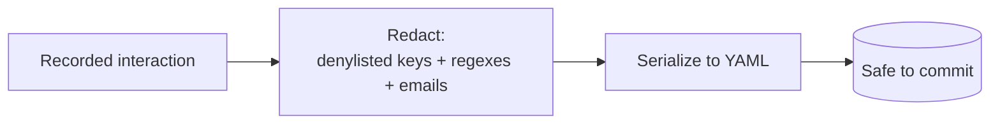

# Redaction

**Cassettes get committed to Git, so they must not contain secrets. AgentTape scrubs API keys, tokens, and PII *before* anything is written to disk — automatically, with sensible defaults.**

---

## It's on by default

You don't have to configure anything to be safe. Out of the box, AgentTape redacts:

- **Sensitive fields/headers** by name — `Authorization`, `api_key`, `password`, `token`, `Cookie`, `client_secret`, and ~20 more (case-insensitive).
- **Known secret patterns** anywhere in a string — OpenAI `sk-...` and `sk-proj-...` keys, Slack `xox...` tokens, GitHub `ghp_/gho_/ghs_` tokens, AWS `AKIA...` keys, Google `AIza...` keys, `Bearer ...` tokens, and PEM private-key blocks.
- **Email addresses**.

Redacted values are replaced with the placeholder `***REDACTED***`.

!!! info "Where it runs"
    Redaction is the **last** step before serialization: `cassette → dict → redact → write`. Secrets never touch the filesystem. On top of this, the raw-HTTP adapter drops sensitive request headers (`Authorization`, `Cookie`, …) entirely before they're even handed to the recorder.



---

## The two layers

| Layer | What it does | Example |
| --- | --- | --- |
| **Denylisted keys** | Any mapping key whose name matches → its **whole value** is replaced | `"api_key": "sk-123"` → `"api_key": "***REDACTED***"` |
| **Value regexes** | Any string value is scanned; matching **substrings** are replaced | `"Bearer abc.def"` → `"***REDACTED***"` |

---

## Adding your own rules

Configure extras under the `[redact]` table in `agenttape.toml`. These **add to** the built-ins — they don't replace them.

```toml title="agenttape.toml"
[redact]
# Extra field/header names to fully redact (case-insensitive)
denylist = ["x-internal-token", "ssn"]

# Extra regexes to scrub from any string value
regexes = ["cust_[a-z0-9]{12}", "\\b\\d{3}-\\d{2}-\\d{4}\\b"]

# Toggle email redaction (default: true)
redact_emails = true

# Change the placeholder (default: ***REDACTED***)
placeholder = "[SCRUBBED]"

# Disable redaction entirely (default: true). Not recommended.
enabled = true
```

| Key | Type | Default | Purpose |
| --- | --- | --- | --- |
| `denylist` | `list[str]` | `[]` | Extra key/header names to fully redact |
| `regexes` | `list[str]` | `[]` | Extra value patterns to scrub |
| `redact_emails` | `bool` | `true` | Redact email addresses |
| `placeholder` | `str` | `***REDACTED***` | Replacement text |
| `enabled` | `bool` | `true` | Master switch |

!!! tip "Redacting a custom secret"
    AgentTape can't know about *your* internal token formats. If you have, say, a `cust_xxxx` API key, add its shape to `regexes` (as above) or its field name to `denylist`. An invalid regex is ignored rather than breaking a recording.

---

## Fixing an already-recorded cassette

Recorded a cassette before configuring an extra rule? Re-run redaction over it in place — it applies your **current** `agenttape.toml` config:

```bash
agenttape redact cassettes/login.yaml
```

And scan any cassette for leaked secrets at any time:

```bash
agenttape validate cassettes/login.yaml
```

`validate` flags values matching the built-in secret patterns and emails so you can catch a leak before it's merged.

---

## Best practices

!!! tip
    - **Keep redaction enabled.** It's the default for a reason.
    - **Add your internal secret formats to `regexes`** so they're caught everywhere, not just in known headers.
    - **Run `agenttape validate` in CI** (or a pre-commit hook) to fail the build if a secret slips through.
    - **Don't hardcode literal secrets in `agenttape.toml`** — use a *pattern* (`regexes`) or a *field name* (`denylist`), so the config file itself never contains a secret.

---

## FAQ

??? question "Does redaction change matching?"
    Matching is computed in a way that tolerates redaction — recordings are also indexed by their stored `match_key`, so hand-written keys and keys computed before redaction still resolve. In practice, redact freely; replay still matches.

??? question "Is there an `env_secrets` option to redact env-var values?"
    No. Instead, add the secret's *pattern* to `regexes` or its *field name* to `denylist`. The built-in patterns already cover the common provider key formats, so most real keys are redacted with no config at all.

??? question "Can I turn redaction off for debugging?"
    Set `enabled = false` under `[redact]`. Do this only on cassettes you'll never commit — the whole point is that cassettes are shareable.

---

## Summary

- Redaction is automatic: built-in denylisted keys + secret-pattern regexes + emails, replaced with `***REDACTED***`.
- It runs before anything is written, so secrets never hit disk.
- Extend it via `[redact]` (`denylist`, `regexes`, `redact_emails`, `placeholder`) — additive to the built-ins.
- `agenttape redact` re-applies config to an old cassette; `agenttape validate` scans for leaks.

[Next: Testing AI Apps →](testing-ai-apps.md){ .md-button .md-button--primary }
