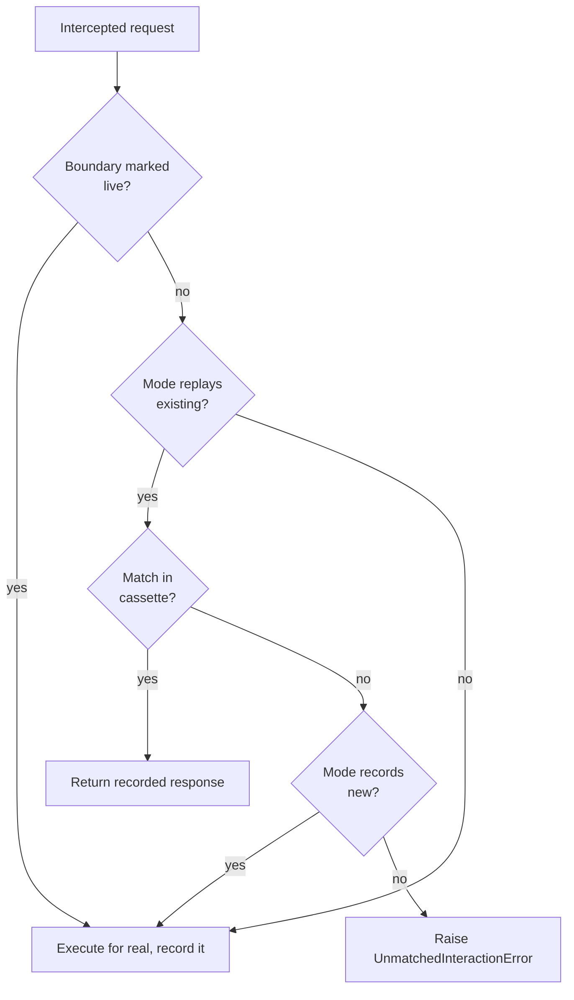
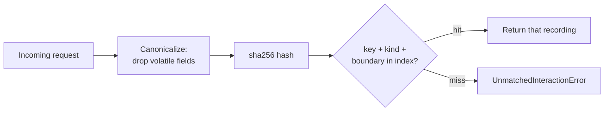

# Replay Engine

**The engine is the brain of AgentTape. On every intercepted call it decides: replay a recording, run the real boundary, or fail loud. This page explains how it matches and why it's strict.**

---

## The decision, on every call



The two inputs to this decision are the [mode](cassette-modes.md) and the [live/frozen](mixed-replay.md) sets. Everything else is matching.

---

## How matching works

When AgentTape records, it stores interactions in order and indexes each one by a **match key**: a `sha256:` hash of the request, computed after dropping volatile fields (timestamps, request IDs). Recordings are looked up by `(kind, boundary, key)`.

On replay, AgentTape computes the same key for the incoming request and looks it up:



### Collisions and order

If two recordings share the same key (a genuine duplicate call, or a deliberate collision), they're served in **recorded order** — the first unconsumed one wins, then the next, and so on. This means repeated identical calls replay in the sequence you recorded them.

---

## Matchers

A **matcher** is the rule that reduces a request to its comparison key. AgentTape ships several; the default handles almost everything.

| Matcher | Behavior |
| --- | --- |
| **`ignore_volatile`** *(default)* | Hash the request after dropping volatile fields (timestamps, request IDs, `User-Agent`, …) |
| `exact` | Hash the request verbatim — nothing ignored. Byte-for-byte strict. |
| `ordered` *(alias `sequential`)* | Ignore content entirely; match the Nth call of a kind in sequence |
| `semantic_stub` | A documented hook for embedding-based matching. The core makes no embedding calls, so it falls back to `ignore_volatile` behavior. |
| `custom` | Any `Callable[[request], str]` you supply |

### Why `ignore_volatile` is the default

Some request fields change every run but don't affect meaning — a `Date` header, a generated `trace_id`, a `User-Agent`. `ignore_volatile` drops a conservative built-in list of these before hashing, so a harmless timestamp difference doesn't break an otherwise-identical match. You can extend the list via [`ignore_volatile_fields`](configuration-ref.md#ignore_volatile_fields).

### Choosing matchers

```python
# Strictest possible: every byte must match
with agenttape.use_cassette("crypto", matchers=["exact"]):
    ...

# Match purely by call order, ignore arguments
with agenttape.use_cassette("flow", matchers=["ordered"]):
    ...

# Your own keying function
with agenttape.use_cassette("x", matchers=[lambda req: req["model"]]):
    ...
```

You can pass several matchers; they form a **fallback chain** — the first that resolves to an unconsumed recording wins.

---

## When a match fails

AgentTape refuses to proceed. It does **not** skip ahead, and it does **not** fall back to the network (unless `mode="new_episodes"` or the boundary is `live`). Instead it raises a precise, actionable error:

```text
No recorded tool interaction matched this incoming request (get_weather).
Cassette: cassettes/weather.yaml
Mode: none

Incoming (canonical) request:
    {
      "name": "get_weather",
      "args": {
        "city": "Paris"
      }
    }

Closest recorded request:
    {
      "name": "get_weather",
      "args": {
        "city": "London"
      }
    }

Field differences (expected = recorded, received = incoming):
  - args.city: expected 'London', received 'Paris'

How to fix:
  * If this request is new and expected, re-record with mode='all'/'new_episodes' or the --agenttape-record flag.
  * If a volatile field is causing the mismatch, add it to ignore_volatile_fields in agenttape.toml.
  * To run this boundary for real during replay, add it to the live={...} set of use_cassette().
```

The engine finds the **closest** recorded request (fewest differing fields) and shows the exact field-level diff. You see immediately whether this is an intentional change (re-record) or a regression (fix the code).

[Debugging unmatched interactions →](debugging.md){ .md-button }

---

## FAQ

??? question "Is matching global or sequential?"
    Primarily keyed: AgentTape finds the recording whose request hashes to the same key. When multiple recordings share a key, ties break by recorded order. Pure-sequence matching is opt-in via the `ordered` matcher.

??? question "Two identical calls return different things — how does replay know which is which?"
    They share a key, so they're served in the order recorded: the first call gets the first recording, the second call gets the second. As long as your code makes them in the same order, replay is correct.

??? question "Why didn't a tiny timestamp difference break my replay?"
    Because `ignore_volatile` drops known volatile fields before hashing. If a *non*-listed dynamic field is breaking matches, add it to `ignore_volatile_fields`.

---

## Summary

- The engine decides replay-vs-execute from the mode and live/frozen sets.
- It matches by hashing the request (volatile fields dropped) and looking up `(kind, boundary, key)`.
- Key collisions are served in recorded order.
- No match → a precise `UnmatchedInteractionError` with the closest record and field diffs. It never silently hits the network.

[Next: Determinism →](determinism.md){ .md-button .md-button--primary }
