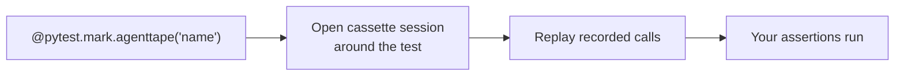

# Testing AI Apps

**AgentTape ships a first-class pytest plugin. Bind a test to a cassette with one marker, and it runs offline, free, and deterministic by default.**

---

## What you're actually testing

Testing an agent isn't asserting `2 + 2 == 4`. You're asserting that, given recorded model responses, your agent:

- produces a sensible final output,
- calls the right tools, in the right order,
- and doesn't silently change behavior when you refactor.

AgentTape gives you assertions for all three.

---

## The plugin is automatic

Installing AgentTape registers the pytest plugin — no setup. Tests marked with `@pytest.mark.agenttape` run in `mode="none"` (offline replay) by default, so CI is always fast and free.



---

## Your first test

```python title="test_weather.py"
import pytest
from my_app import weather_agent

@pytest.mark.agenttape("weather_sunny_london")
def test_weather_agent(agenttape_cassette):
    result = weather_agent.run("What is the weather in London?")

    # Assert on the final output
    assert "sunny" in result.lower()

    # Assert on behavior: which tools ran, in what order
    agenttape_cassette.assert_tool_calls(["get_location", "get_weather"])
```

!!! success "What happened?"
    1. The marker binds the test to `cassettes/weather_sunny_london.yaml`.
    2. AgentTape opens a session around the test and replays the recorded LLM + tool calls.
    3. `assert_tool_calls` verifies the agent invoked exactly those tools, in that order.

---

## Recording the cassette

The first run fails — the cassette doesn't exist yet. Record it by adding a flag (this hits real services and writes the file):

```bash
pytest --agenttape-record
```

Then run normally — instant, offline replay:

```bash
pytest
```

| Command | Mode | Network |
| --- | --- | --- |
| `pytest` | `none` | Off (replay) |
| `pytest --agenttape-record` | `all` | On (re-records marked tests) |
| `pytest --agenttape-mode once` | `once` | First run only |

---

## The `agenttape_cassette` fixture

Request the `agenttape_cassette` fixture to get a `CassetteHandle` with assertions and introspection.

### Assertions

```python
@pytest.mark.agenttape("checkout")
def test_checkout(agenttape_cassette):
    run_agent()

    agenttape_cassette.assert_tool_calls(["lookup_price", "charge_card"])
    agenttape_cassette.assert_final_output("Order confirmed")
    agenttape_cassette.assert_snapshot()   # fails on ANY drift from the recording
```

| Method | Fails when… |
| --- | --- |
| `assert_tool_calls(list)` | The tool/retrieval boundary names (in order) differ |
| `assert_final_output(value)` | The agent's final output differs |
| `assert_snapshot()` | The full interaction sequence drifts from the cassette |

### Introspection

| Property | Returns |
| --- | --- |
| `tool_calls` | List of tool/retrieval boundary names exercised |
| `final_output` | The run's final output |
| `interactions` | The full timeline of interactions |
| `path` / `mode` | The cassette file path / active mode |

---

## Snapshot testing: catch silent regressions

`assert_snapshot()` compares the **entire** sequence of interactions in this run against the cassette. If the agent decides to call `get_weather` twice instead of once — or reorders its calls — the snapshot fails with a readable diff.

```python
@pytest.mark.agenttape("weather_sunny_london")
def test_no_regression(agenttape_cassette):
    weather_agent.run("What is the weather in London?")
    agenttape_cassette.assert_snapshot()
```

This is the strongest guard against your agent silently changing behavior when you tweak a prompt or bump the model.

---

## Marker options

The marker accepts the same knobs as `use_cassette`:

```python
# Auto-name the cassette from the test node (no explicit name)
@pytest.mark.agenttape
def test_auto(agenttape_cassette): ...

# Partial replay inside a test
@pytest.mark.agenttape("rag", live={"llm"})
def test_new_prompt(agenttape_cassette): ...

# Custom matchers / freeze
@pytest.mark.agenttape("x", matchers=["ordered"], freeze=["uuid"])
def test_ordered(agenttape_cassette): ...
```

Supported marker kwargs: `mode`, `live`, `frozen`, `matchers`, `freeze`, `format`. If you omit the cassette name, AgentTape derives it from the test's node name.

---

## A realistic CI setup

```yaml title=".github/workflows/ci.yml"
- name: Test (offline, deterministic)
  run: pytest          # mode=none — no API keys, no network needed
```

Cassettes are committed to the repo, so CI needs **no secrets** and runs offline. Re-record locally when behavior changes intentionally, and the cassette diff lands in the PR for review.

---

## FAQ

??? question "Do I need the fixture, or just the marker?"
    The marker alone opens a session around the test (via an autouse fixture), so replay works without requesting `agenttape_cassette`. Request the fixture only when you want the assertions or introspection.

??? question "How do I update one cassette without re-recording all of them?"
    Run a single test with the record flag: `pytest path::test_name --agenttape-record`.

??? question "My snapshot test fails after a prompt change — is that a bug?"
    No, that's the point. Decide: intentional change → re-record. Unintended → fix the code. See [Debugging](debugging.md).

---

## Summary

- `@pytest.mark.agenttape("name")` binds a test to a cassette; tests replay offline by default.
- `pytest --agenttape-record` (re)records against real services.
- The `agenttape_cassette` fixture offers `assert_tool_calls`, `assert_final_output`, `assert_snapshot`.
- Snapshot tests catch silent behavioral regressions; CI needs no API keys.

[Next: Recording APIs →](recording-apis.md){ .md-button .md-button--primary }
