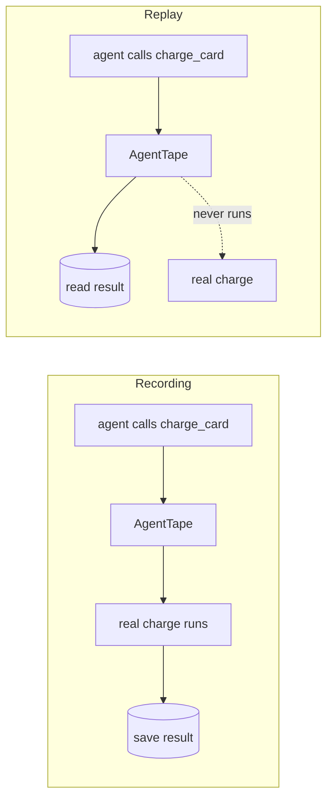

# Tools

**A tool is any function your agent uses to act on the world. Mark it with `@agenttape.tool` and AgentTape records it while recording — and mocks it on replay, so it never executes for real.**

---

## Why tools need recording

Intercepting LLM calls saves money. Intercepting **tools** is about *safety*.

If your agent can call `delete_user(id)` or `charge_card(amount)`, you cannot let those run during a test suite. Mark the function as a boundary and AgentTape guarantees it only executes during a real recording. On replay it returns the saved output and the real code is never touched.



---

## The basic pattern

```python
import agenttape
import requests

@agenttape.tool
def get_user_profile(user_id: int) -> dict:
    resp = requests.get(f"https://api.example.com/users/{user_id}")
    return resp.json()
```

That's the only change. Inside a session it's recorded/replayed; **outside** a session it behaves exactly like the original function.

=== "During record"

    1. Agent calls `get_user_profile(42)`.
    2. AgentTape intercepts it.
    3. The real function runs and hits the network.
    4. AgentTape saves `args={user_id: 42}` and the returned dict.
    5. The result is returned to the agent.

=== "During replay"

    1. Agent calls `get_user_profile(42)`.
    2. AgentTape intercepts it.
    3. It looks up `get_user_profile` with `user_id=42` in the cassette.
    4. It returns the saved dict. **The real function never runs** — no network, no `requests` import needed.

---

## How arguments are matched

AgentTape binds your call to the function's parameter names, so the recorded request is stable and readable:

```python
@agenttape.tool
def search(query: str, top_k: int = 3): ...

search("cats")          # recorded request: {query: "cats", top_k: 3}
search("cats", top_k=5) # recorded request: {query: "cats", top_k: 5}
```

Defaults are filled in, and `self`/`cls` are dropped for methods. On replay, the incoming arguments must match a recording or you get an [`UnmatchedInteractionError`](debugging.md).

---

## Semantic boundary decorators

All four decorators behave identically at runtime — they only change the `kind` label in the cassette, which makes recordings easier to read and filter.

| Decorator | `kind` | Use for |
| --- | --- | --- |
| `@agenttape.tool` | `tool` | General actions: APIs, payments, calculators, Slack |
| `@agenttape.retrieval` | `retrieval` | Vector-store / search lookups ([guide](recording-vector-stores.md)) |
| `@agenttape.memory_read` | `memory_read` | Reading agent long-term memory |
| `@agenttape.memory_write` | `memory_write` | Writing agent long-term memory |

```python
@agenttape.retrieval
def search_docs(query: str) -> list[str]:
    ...

@agenttape.tool(name="charge")   # override the recorded boundary name
def charge_card(amount: int) -> dict:
    ...
```

Async functions work too — decorate an `async def` and it's awaited normally.

---

## The golden rule: serialize at the boundary

AgentTape serializes a tool's arguments and return value to YAML. **Pass and return simple, serializable types** — strings, ints, dicts, lists.

If you pass a live DB connection or a custom object, AgentTape falls back to a string like `<MyObj at 0x103…>`. The memory address changes every run, so matching fails on replay.

=== "Don't"

    ```python
    @agenttape.tool
    def get_status(conn: DatabaseConnection, user: UserObject) -> None:
        ...   # conn and user can't serialize reliably
    ```

=== "Do"

    ```python
    @agenttape.tool
    def get_status(user_id: int) -> str:
        conn = get_global_db()          # connection handled INSIDE the boundary
        return conn.query_status(user_id)  # returns a plain string
    ```

---

## Best practices

!!! tip
    - **Wrap only boundary functions** — things that cross network/disk/DB. Don't wrap pure business logic.
    - **Keep boundaries small.** Extract the side-effecting line into its own function and wrap that, not a 50-line handler.
    - **Return primitives.** Convert ORM models and cursors to dicts before returning.

---

## FAQ

??? question "Does a `@tool` do anything outside a `use_cassette` block?"
    No. With no active session it just calls the original function. AgentTape only intercepts inside a session.

??? question "Can I record a method on a class?"
    Yes. `self`/`cls` are stripped from the recorded arguments automatically, so only the meaningful parameters are matched.

??? question "What about a one-off call I can't decorate?"
    Use the low-level [`record_call(...)`](api.md#record_call) helper to route a single boundary crossing through the active session with an explicit request payload.

---

## Summary

- `@agenttape.tool` makes any function a recorded boundary.
- Recording runs it for real; replay returns the saved output and never executes it.
- Use `retrieval` / `memory_read` / `memory_write` for clearer cassettes.
- Pass and return serializable primitives so matching stays stable.

[Next: the Replay Engine →](replay-engine.md){ .md-button .md-button--primary }
