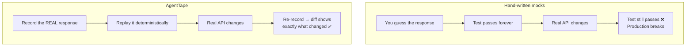

# Why AgentTape?

**Testing AI agents forces a bad trade-off: real services are slow, costly, and unsafe — but mocks are brittle and unrealistic. AgentTape gives you a third option.**

---

## The problem

When you test an agent against live services, three things go wrong at once.

!!! danger "1. Cost & latency"
    Every unit test hits OpenAI, Anthropic, or another provider. Each call costs tokens and takes 1–5 seconds. A 200-test suite becomes a 15-minute, multi-dollar CI run. Slow suites get run less; expensive suites get disabled.

!!! danger "2. Non-determinism"
    LLMs are probabilistic. Even at `temperature=0`, providers update models, change defaults, and return slightly different text. A test that asserts on model output is flaky by construction — and flaky tests get ignored.

!!! danger "3. Side effects"
    Agents don't just talk; they *act*. If your agent has a `charge_card`, `send_email`, or `execute_sql` tool, a test run will really run it. You cannot let a CI pipeline charge real cards because an assertion changed.

---

## Why mocks aren't enough

The traditional fix is to mock every API and tool. But mocks have a fundamental flaw:

> A mock tests your **assumptions** about a service, not the service itself.

When the real API changes its response shape, your mock keeps returning the old shape. Your tests stay green. Your production code breaks. You've built a test suite that's confident and wrong.

---

## The AgentTape approach

AgentTape captures a real interaction **once**, then replays the captured bytes forever. You get the realism of an end-to-end test with the speed and safety of a mock.

| | End-to-end tests | Hand-written mocks | **AgentTape** |
| --- | --- | --- | --- |
| Realistic | ✅ | ❌ | ✅ (it *is* real, recorded) |
| Fast | ❌ | ✅ | ✅ |
| Free | ❌ | ✅ | ✅ |
| Deterministic | ❌ | ✅ | ✅ |
| Safe side effects | ❌ | ✅ | ✅ |
| Detects API drift | ✅ | ❌ | ✅ (re-record + diff) |

---

## The design principles

AgentTape is opinionated. Four principles shape every feature.

### 1. Local-first

No servers, no telemetry, no network during replay. Cassettes are plain files in your repo. Your tests run on a plane, and your CI never needs API keys.

### 2. Zero side effects

In replay, a recorded tool **never executes for real**. This is the core safety guarantee — it's what makes AgentTape safe for agents that take destructive actions.

### 3. Git-friendly

Cassettes are YAML: human-readable, reviewable in a pull request, and hand-editable. Want to test how your code handles malformed JSON from an LLM? Edit the cassette. No prompt engineering required.

### 4. Fail loud, never silent

If a request doesn't match the cassette during replay, AgentTape raises immediately. It will **not** quietly fall back to the network or run the tool. A surprising request is a bug you want to see, not hide.

---

## When to reach for AgentTape

!!! tip "Good fit"
    - Unit/integration tests for agents, chains, and tool-using workflows.
    - CI pipelines that must be offline, fast, and free.
    - Local development and refactoring without burning tokens.
    - Reproducing a production agent failure deterministically.
    - Comparing prompts or models against a frozen baseline ([Partial Replay](mixed-replay.md)).

!!! warning "Not a fit"
    - Load testing or benchmarking real latency (replay is artificially fast).
    - Asserting that a *live* model still produces a specific answer today (that's a monitoring job, not a test).
    - Streaming token-by-token responses, which can't be recorded deterministically — see [Determinism](determinism.md).

---

## FAQ

??? question "Isn't this just VCR / cassette libraries for HTTP?"
    The idea is inspired by [VCR](https://github.com/vcr/vcr), but AgentTape works at the **boundary** level, not just HTTP. It records LLM SDK calls *and* arbitrary Python tool functions (DB writes, payments) — things that never touch HTTP. It also freezes time, UUIDs, and randomness so prompts that embed "today's date" still match on replay.

??? question "Do I have to rewrite my agent to use it?"
    No. Wrap your code in a `with agenttape.use_cassette(...)` block (or a decorator) and the built-in adapters intercept OpenAI/httpx/requests automatically. For custom side-effecting functions, add one `@agenttape.tool` decorator.

??? question "What if the real API changes?"
    Re-record the cassette and `agenttape diff` shows exactly what changed. That's a feature: drift becomes a reviewable line in a pull request instead of a silent production break.

---

## Summary

- Live-service tests are slow, costly, flaky, and unsafe.
- Hand-written mocks are fast but brittle — they test assumptions, not reality.
- AgentTape records the **real** interaction once, then replays it deterministically.
- Result: offline, free, byte-for-byte tests with zero side effects.

[Install AgentTape →](installation.md){ .md-button .md-button--primary }
