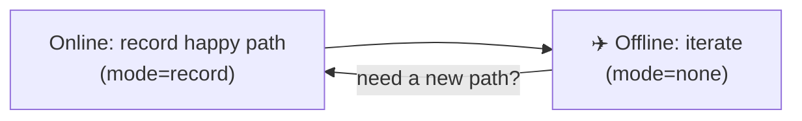

# Working Offline

**Because every external call lives in a local cassette, you can run your whole agent stack with the network off — refactor, build UI, and simulate failures without spending a token.**

---

## The offline loop



1. **Online (rare):** write the agent, run once with `mode="record"` to capture the happy path.
2. **Offline (constant):** disconnect. Run with `mode="none"`. Refactor, build the UI, write parsing logic — instantly and for free.
3. **Iterate:** when the agent needs a genuinely new path, reconnect briefly to record it, then go offline again.

---

## Refactoring the code around your agent

The most common reason to work offline: you're improving logic *around* the model, not the model call itself.

```python
import agenttape

def parse_llm_output(text: str) -> dict:
    ...   # the function you're actually iterating on

with agenttape.use_cassette("complex_task", mode="none"):
    raw = agent.run("Do the complex task")
    print(parse_llm_output(raw))
```

The LLM response is served from the cassette in milliseconds, so you can run this loop hundreds of times a minute while you perfect `parse_llm_output`.

---

## Frontend / UI development

Building a chat UI? Wrap the backend endpoint in a `use_cassette` block and your frontend gets instant responses instead of waiting 3–5 seconds for the model. The dev experience feels snappy, and you don't burn tokens on every page reload.

---

## Faking errors

Offline is the easiest place to test failure handling — just edit the cassette. There are two ways.

=== "Edit an HTTP response"

    Change the status code of a captured HTTP interaction to exercise your retry/error logic:

    ```yaml
    - kind: http
      boundary: api.example.com
      request: { method: GET, url: "https://api.example.com/data" }
      response:
        status_code: 500
        text: "Internal Server Error"
    ```

    Run in `mode="none"` and your code receives a real 500.

=== "Inject a raised error"

    Replace an interaction's `response` with an `error` block. AgentTape re-raises it on replay — as the real exception type when the class is importable:

    ```yaml
    - kind: tool
      boundary: charge_card
      request: { name: charge_card, args: { amount: 4200 } }
      error:
        type: TimeoutError
        module: builtins
        message: "payment gateway timed out"
    ```

    On replay, `charge_card(4200)` raises `TimeoutError("payment gateway timed out")` — so you can test your `except` path offline.

!!! tip "No prompt engineering required"
    You don't have to coax the model into producing malformed output or trick an API into failing. Edit the YAML, run offline, and your code hits the edge case deterministically.

---

## What still needs the network

!!! warning
    Anything **new** needs a recording first. If your code makes a call that isn't in the cassette while in `mode="none"`, AgentTape raises [`UnmatchedInteractionError`](debugging.md) rather than silently going online. That's the design — reconnect, record the new path, then continue offline.

---

## FAQ

??? question "Can CI run fully offline?"
    Yes — that's the recommended setup. Commit cassettes, run `pytest` (mode `none`), and CI needs no API keys and no network. See [Testing AI Apps](testing-ai-apps.md#a-realistic-ci-setup).

??? question "I edited a request field and now replay fails — why?"
    Editing a **request** changes its match key, so it no longer matches your code's call. Edit **responses** and **errors** to simulate behavior; only change requests if you also change the code that makes them. See the [editing guidelines](format.md#editing-guidelines).

---

## Summary

- Cassettes make the whole stack runnable offline, instantly, for free.
- Iterate on the code around your agent without re-hitting the model.
- Simulate failures by editing a response status or injecting an `error` block.
- New, unrecorded calls still need a one-time online recording.

[Next: Debugging →](debugging.md){ .md-button .md-button--primary }
