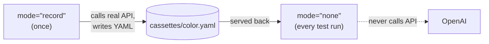

# Your First Recording

**A five-minute walkthrough: call an LLM, record it, then replay it offline — and edit the cassette to fake an answer.**

By the end you'll understand the whole record → replay loop and be able to apply it to your own agent.

---

## Before you start

```bash
pip install "agenttape[openai]"
export OPENAI_API_KEY="sk-..."   # needed only for the recording step
```

---

## Step 1 — The code to test

Here's a function that asks an LLM for a color. Notice there is **nothing AgentTape-specific** about it — it's ordinary OpenAI code.

```python title="agent.py"
from openai import OpenAI

def get_random_color() -> str:
    client = OpenAI()
    response = client.chat.completions.create(
        model="gpt-5.5",
        messages=[{"role": "user", "content": "Name a random color. One word."}],
    )
    return response.choices[0].message.content
```

Run it directly and it costs money, returns a different word each time, and fails with no internet. Let's fix all three.

---

## Step 2 — Record

Wrap the call in a `use_cassette` block with `mode="record"`.

```python title="record.py" hl_lines="5"
import agenttape
from agent import get_random_color

# mode="record" forces a real API call and saves the result.
with agenttape.use_cassette("color", mode="record"):
    color = get_random_color()
    print(f"The LLM chose: {color}")
```

```bash
python record.py
# The LLM chose: Crimson
```

!!! success "What happened?"
    1. AgentTape intercepted `client.chat.completions.create`.
    2. It forwarded the request to the real OpenAI API.
    3. It saved the prompt **and** the response to a new file: `cassettes/color.yaml`.
    4. It returned the response to your function.

---

## Step 3 — Replay

Now change one word: `mode="record"` → `mode="none"`. (`none` means "replay only, never touch the network".)

```python title="replay.py" hl_lines="4"
import agenttape
from agent import get_random_color

with agenttape.use_cassette("color", mode="none"):
    color = get_random_color()
    print(f"The LLM chose: {color}")
```

```bash
python replay.py
# The LLM chose: Crimson   ← same answer, every time
```

!!! success "What happened?"
    1. AgentTape intercepted the call.
    2. It matched your prompt against `cassettes/color.yaml`.
    3. It returned the saved response **without any network request**.

Try it with your Wi-Fi off and no `OPENAI_API_KEY`. It still works, and it runs in milliseconds.

---

## Step 4 — Look inside the cassette

The cassette is plain YAML. Open `cassettes/color.yaml`:

```yaml title="cassettes/color.yaml"
version: '1'
created_at: '2026-06-17T12:00:00.000000'
run_id: bee71bc9-33b8-431b-8012-00a753783931
meta:
  agenttape_version: 0.1.5
  mode: record
  freeze:
    features: [clock, random, uuid]
    base_time: 1781706140.86
    base_iso: '2026-06-17T12:00:00+00:00'
interactions:
  - index: 0
    kind: llm
    boundary: llm
    request:
      endpoint: chat.completions
      model: gpt-5.5
      messages:
        - role: user
          content: Name a random color. One word.
    response:
      # ... the full OpenAI response object (trimmed here for clarity) ...
      choices:
        - message:
            role: assistant
            content: Crimson
    match_key: 'sha256:1ed923...'
    usage: {prompt_tokens: 14, completion_tokens: 1, total_tokens: 15}
    latency_ms: 812.4
```

The key fields:

| Field | Meaning |
| --- | --- |
| `request` | What your code sent — used to match on replay |
| `response` | What the provider returned — served back on replay |
| `match_key` | A hash of the request; how AgentTape finds the right recording |
| `usage` / `latency_ms` | Captured metrics (free to inspect with the CLI) |

[Full schema reference →](format.md)

---

## Step 5 — Fake an answer by editing the file

Because it's just text, you can change the recorded answer. Edit the `content` field:

```yaml
            content: Octarine
```

Run `python replay.py` again:

```bash
python replay.py
# The LLM chose: Octarine
```

!!! tip "Why this is powerful"
    You just changed your agent's input without prompting the model into it. This is how you test edge cases — malformed JSON, empty responses, rate-limit errors — deterministically and offline. See [Working Offline](working-offline.md#faking-errors).

---

## The mental model



Record rarely (when behavior intentionally changes). Replay constantly (every test, every CI run).

---

## Summary

- Wrap any code in `use_cassette("name", mode="record")` to capture real traffic.
- Switch to `mode="none"` to replay it offline, free, and deterministically.
- Cassettes are readable YAML in `cassettes/` — inspect, diff, and hand-edit them.
- Editing a recorded response is the easiest way to test edge cases.

[Next: the Quickstart reference →](quickstart.md){ .md-button .md-button--primary }
